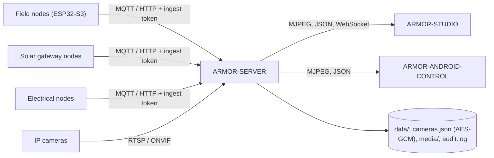

<p align="center">
  
</p>

# 🛡️ ARMOR-SERVER

<p align="center">
  🇺🇸 <b>English</b> |
  <a href="README_spa.md">🇪🇸 Español</a> |
  <a href="README_fra.md">🇫🇷 Français</a> |
  <a href="README_ita.md">🇮🇹 Italiano</a> |
  <a href="README_deu.md">🇩🇪 Deutsch</a> |
  <a href="README_zho.md">🇨🇳 简体中文</a> |
  <a href="README_jpn.md">🇯🇵 日本語</a>
</p>

### Central security coordinator: telemetry ingress, alarms, devices, solar readings and the camera gateway

<p align="center">
  
  
  
  
  
</p>

---

**Honesty check - what runs today:** Every route, session, encryption and evidence rule below is real and covered by tests (`npm test`, 271 tests, including a full HTTP integration suite against an isolated server). It has run against a real MQTT broker on the CM5 (with scripts and with two real radar nodes), and has streamed live video, saved a snapshot and recorded from five real IP cameras through FFmpeg. What is **not** proven yet: ONVIF against a real ONVIF camera, PTZ on every camera firmware (it works on the Hi3510 unit), any Jetson hardware, and the solar routes against a real gateway node (they are tested with generated readings).

---

## 🎯 Overview

**ARMOR-SERVER** is the trusted centre of A.R.M.O.R. Field nodes publish radar, light and health observations; this service validates them, keeps the last known state of every node, and serves that state to the Studio console and the Android client. It also owns everything that touches a camera, so that **no browser and no phone ever holds a camera password or an RTSP address**.

* **Validated ingest:** HTTP and MQTT observations are checked at the boundary (identifier, timestamps, lux range, at most 15 tracks) before they reach the state projection.
* **Honest node state:** a node that stops talking is shown as *stale* and *offline* after a configurable window, never as online on old data. Disarming clears a high alert at once.
* **Camera gateway:** encrypted camera vault, ONVIF / Hi3510 / PSIA PTZ, RTSP path discovery, one shared FFmpeg relay per camera, snapshots and MP4 recording, and a watchdog that turns a camera that stops answering into an event and, while armed, an alarm.
* **Evidence library:** oldest-first retention by age and size, **protected evidence** that is never pruned, and a SHA-256 for chain of custody. One audit line per security-relevant action, with credentials scrubbed.
* **State that survives:** the security mode and every node's last observation are restored after a restart (a restart never silently disarms the perimeter). Every alert-level, node-status and mode change is kept in an event history.
* **Alarm output:** high alerts and, while armed, silent or offline nodes go to MQTT `armor/server/alert` and an optional HMAC-signed webhook; a dwell time before HIGH and ignore zones are tuned from Studio.
* **Users:** names and passwords (scrypt hashes), an `admin` role that manages users and an `operator` role that operates; a changed password or role ends that user's other sessions.
* **Devices, alarms and automations:** smoke, gas, flood, door, window, motion, climate, plug, light, siren and lock devices over MQTT or an authenticated push, with normalised state, availability and commands; alarms with a raised / acknowledged / cleared lifecycle; rules that switch devices when something happens; arm and disarm from a signed-in session; and the site design kept on the server for every client.
* **Solar readings:** inverters and battery stacks (with each cell and the capacities) arrive by HTTP or MQTT, are validated by the shared contract, kept with a history (a sample every 30 s for a day) and totals, marked stale after two minutes, and raise four alarms (inverter fault, battery low, battery alarm, device silent).
* **The machine, the network and the panel:** `GET /api/v1/system/metrics` (CPU, memory, disks, temperature, network and a short history of the machine it runs on), `GET/PUT /api/v1/system/connection` (the address and ports it listens on, an administrator's, applied at the next start), `GET /api/v1/panel/summary` (a few hundred bytes for small screens) and, for the network node, the logins an administrator keeps for a device's web administration: encrypted (AES-256-GCM), never sent back, and handed over only inside the one `inspect` order that needs them.

## 🔄 Architecture



## 🔒 Security model

* Four separate secrets: **ingest** (posting telemetry, health and solar readings), **control** (arm / disarm, events), **operator** (automation) and the **Studio login**; each is compared in constant time and none stands in for another.
* Every route that configures, moves, captures, records, protects or deletes needs an operator. Live video needs an operator or a short-lived stream ticket tied to one camera.
* Camera passwords live only in `data/cameras.json`, AES-256-GCM encrypted, and no API returns them; ONVIF addresses must stay on the camera's host and redirects are refused.
* Studio sessions are HttpOnly and SameSite=Strict for 8 hours, login is rate limited and errors never carry a stack trace.
* The server listens on 127.0.0.1 unless `ARMOR_HOST` is set on purpose, and then a Studio password shorter than 12 characters is refused.

## 🌐 API

* Public: `GET /healthz`. For an operator: status, information, cameras, media, history, rules, devices, alarms, automations, the site design, and `GET /api/v1/solar` with its history.
* For the field nodes and the gateways: `POST /api/v1/telemetry`, `/health`, `/solar` and `/electrical/readings` with the ingest token, and the MQTT topics `armor/node/#`, `armor/solar/#` and `armor/electrical/#`. Events reach the consoles by the WebSocket `/api/v1/events`.
* Every route, its access rule and its schema is in the OpenAPI file of [ARMOR-COMMON](https://github.com/JuanenRac/ARMOR-COMMON), and a test checks that no route is missing from it.

## ⚙️ Configuration

* Copy `.env.example` to `.env` (ignored by Git), or let `run.bat` / `run.sh` generate random secrets on the first run.
* Required: `ARMOR_INGEST_TOKEN` and `ARMOR_CONTROL_TOKEN` (24 characters or more, all different) and `ARMOR_STUDIO_USERNAME` / `ARMOR_STUDIO_PASSWORD` (the first administrator).
* Common: `ARMOR_HOST` / `ARMOR_PORT`, `ARMOR_DATA_DIR`, `ARMOR_FFMPEG_PATH` (live video and capture), `ARMOR_MQTT_URL`, `ARMOR_STUDIO_ORIGIN`, `ARMOR_NODE_STALE_AFTER_S`, `ARMOR_CAMERA_CHECK_S`, `ARMOR_ALERT_DWELL_MS`, `ARMOR_ALERT_WEBHOOK_URL` and `ARMOR_COOKIE_SECURE` (set it to `1` behind TLS).
* **Firmware, notices and the voice:** the server updates the firmware of the field nodes (a file or the GitHub release, one node or every node of a type, with progress and a check of the SHA-256), sends the alarms to Telegram and to Home Assistant (with retries and an audit line without secrets, in the seven languages), and carries out fifteen written or spoken commands through the voice gateway (the state, the alarms, the nodes, the cameras, the radars, the solar and electrical systems, the network, the time, help and the lights; arming and disarming are confirmed in a second turn). The observation service raises `camera_motion` through its own token. See [node firmware](docs/NODE_FIRMWARE.md) and [integration](docs/INTEGRATION.md).

## 📂 Repository Structure

```text
ARMOR-SERVER/
├── src/            server, app, config, context, store, persistence, events, rules, notify, contracts, mqtt, audit,
│   │               alarms, automations, users, site, solar, solar_registry, electrical
│   ├── http/       auth primitives
│   ├── routes/     sessions, cameras, media, ingest, history, devices, alarms, users, solar, electrical, system
│   ├── devices/    the device model, kinds and MQTT bridge
│   ├── cameras/    model, vault, digest, ptz, rtsp, discovery, health, errors
│   └── media/      relay, evidence
├── tests/          unit tests + full HTTP integration suite
├── docs/           state machine, camera gateway, integration
├── data/           runtime state (ignored by Git)
└── images/         brand assets
```

## 🛠️ Development Environment

```powershell
npm install
npm run typecheck   # tsc --noEmit
npm test            # 271 tests: unit + full HTTP integration
npm run build       # dist/server.mjs
.\run.bat           # development server with hot reload
```

To install on the CM5 test bench (isolated from every other project, own user, own ports) see [ARMOR-DEVOPS](https://github.com/JuanenRac/ARMOR-DEVOPS).

## 🔗 Related Projects

**A.R.M.O.R.** (Autonomous Radar & Multimodal Observation Range) is a perimeter-security system made of independent repositories. Each one has its own version, its own tests and its own README; this is the family:

* **[ARMOR-COMMON](https://github.com/JuanenRac/ARMOR-COMMON)** - Message contracts, validators, conformance vectors and generated types
* **[ARMOR-RADAR](https://github.com/JuanenRac/ARMOR-RADAR)** - Field-node firmware for ESP32-S3 with three radars and its own web panel
* **[ARMOR-SOLAR](https://github.com/JuanenRac/ARMOR-SOLAR)** - Solar inverter and battery protocols and the messages of a gateway node
* **[ARMOR-ELECTRICAL](https://github.com/JuanenRac/ARMOR-ELECTRICAL)** - Electrical node: meters, the message of the network's readings and the rules for switching
* **[ARMOR-HMI](https://github.com/JuanenRac/ARMOR-HMI)** - Touch panel: the state of the system on a wall screen, arming and acknowledging, and the home of the voice assistant
* **[ARMOR-NETWORK](https://github.com/JuanenRac/ARMOR-NETWORK)** - The local network: its devices, the internet and what changes
* **ARMOR-SERVER** (this repository) - Central coordinator: telemetry, alarms, devices, solar readings and cameras
* **[ARMOR-STUDIO](https://github.com/JuanenRac/ARMOR-STUDIO)** - Web console: cameras, radar, alarms, solar energy and the 2D/3D site designer
* **[ARMOR-ANDROID-CONTROL](https://github.com/JuanenRac/ARMOR-ANDROID-CONTROL)** - Android operator client with a live 2D/3D radar
* **[ARMOR-SERVER-AI](https://github.com/JuanenRac/ARMOR-SERVER-AI)** - Visual inference policy that explains its decisions and never actuates
* **[ARMOR-VOICE-AI](https://github.com/JuanenRac/ARMOR-VOICE-AI)** - Offline voice intents with a confirmation that cannot be forged
* **[ARMOR-HARDWARE](https://github.com/JuanenRac/ARMOR-HARDWARE)** - Enclosures, electronics and the bench acceptance matrix
* **[ARMOR-DEVOPS](https://github.com/JuanenRac/ARMOR-DEVOPS)** - Deployment, the CM5 test bench, backup and TLS
* **[ARMOR-SIMULATOR](https://github.com/JuanenRac/ARMOR-SIMULATOR)** - Offline telemetry simulator with repeatable faults
* **[ARMOR-UPDATER](https://github.com/JuanenRac/ARMOR-UPDATER)** - Detects, installs and updates the ecosystem's own repositories
* **[ARMOR-DOCS](https://github.com/JuanenRac/ARMOR-DOCS)** - Architecture, security baseline and the capability matrix

## 📚 Documentation & Community

Where to read more:

* [Capability matrix: what is proven and what is not](https://github.com/JuanenRac/ARMOR-DOCS/blob/main/docs/CAPABILITY_MATRIX.md)
* [Project catalogue: versions and how the repositories depend on each other](https://github.com/JuanenRac/ARMOR-DOCS/blob/main/docs/PROJECT_CATALOG.md)
* [Changelog of this repository](CHANGELOG.md)
* [License (GPL-3.0-or-later)](LICENSE)
* Questions, ideas and reports: electrohobby3d@gmail.com

## 👤 AUTHOR

**JuanenRac (Electro Hobby 3D)** · electrohobby3d@gmail.com

## 📜 LICENSE

GPL-3.0-or-later - see [LICENSE](LICENSE).
