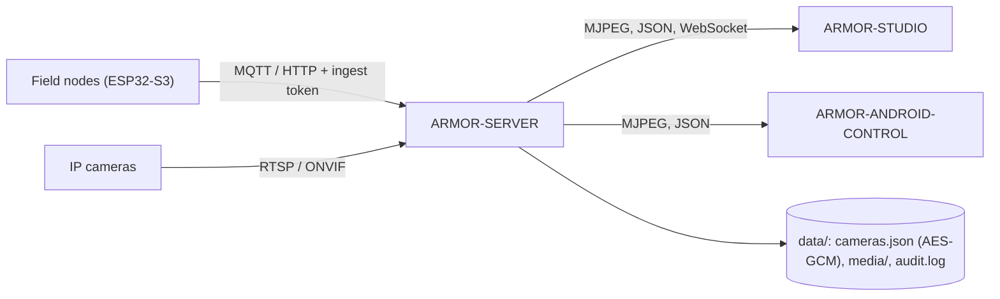

<p align="center">
  
</p>

# 🛡️ ARMOR-SERVER

<p align="center">🇺🇸 <b>English</b> | <a href="README_spa.md">🇪🇸 Español</a></p>

### 🧠 Central Security Coordinator, Telemetry Ingress & Camera Gateway

<p align="center">
  
  
  
  
  
</p>

---

**Honesty check - what runs today:** every route, session, encryption and evidence rule below is real and covered by tests (`npm test`, 75 tests, including a full HTTP integration suite against an isolated server). What is **not** proven yet: MQTT against a real broker, FFmpeg against a real camera, ONVIF/PTZ against every camera firmware, and any Jetson hardware. Those are deployment milestones, tracked in [ARMOR-DOCS](../ARMOR-DOCS), and this README never claims them.

---

## 1. 🛠️ OVERVIEW

**ARMOR-SERVER** is the trusted centre of A.R.M.O.R. Field nodes publish radar, light and health observations; this service validates them, keeps the last known state of every node, and serves that state to the Studio console and the Android client. It also owns everything that touches a camera, so that **no browser and no phone ever holds a camera password or an RTSP address**.

* 📡 **Validated ingest:** HTTP and MQTT observations are checked at the boundary (identifier, timestamps, lux range, at most 15 tracks) before they reach the state projection.
* 🧭 **Honest node state:** a node that stops talking is shown as *stale* and *offline* after a configurable window, never as online on old data. Disarming clears a high alert at once.
* 🔐 **Separated credentials:** ingest, control, operator and Studio-login secrets are all different, all constant-time compared, and none of them is an operator credential for another purpose.
* 🎥 **Camera gateway:** encrypted camera vault, ONVIF / Hi3510 / PSIA PTZ, RTSP path discovery, one shared FFmpeg relay per camera, snapshots and MP4 recording.
* 🗄️ **Evidence library:** oldest-first retention by age and size, **protected evidence** that is never pruned, and a SHA-256 for chain of custody.
* 🧾 **Audit trail:** one JSON line per security-relevant action, with credentials scrubbed.

---

## 2. 🔄 ARCHITECTURE



Source layout (`src/`):

| Module | Responsibility |
|---|---|
| `config.ts` | Reads and **validates** the environment; refuses weak or inconsistent settings |
| `http/auth.ts` | Constant-time compare, cookie parsing, bounded expiring session tables |
| `context.ts` | Builds the shared context (stores, sessions, operator check) |
| `app.ts` / `server.ts` | HTTP + WebSocket assembly / process entry point and graceful shutdown |
| `routes/*.ts` | `sessions`, `cameras`, `media`, `ingest` |
| `cameras/*.ts` | `model` (validation), `vault` (AES-256-GCM), `digest` (RFC 7616), `ptz`, `rtsp`, `discovery` |
| `media/*.ts` | `relay` (FFmpeg MJPEG + stream tickets), `evidence` (capture, retention, hash) |
| `store.ts` / `contracts.ts` / `mqtt.ts` | State projection, trusted-boundary parsing, MQTT ingress |
| `audit.ts` | Rotating JSON-lines audit log |

---

## 3. 🔒 SECURITY MODEL

| Credential | Grants | Never grants |
|---|---|---|
| `ARMOR_INGEST_TOKEN` | Posting telemetry and health | Reading cameras, arming |
| `ARMOR_CONTROL_TOKEN` | Arm / disarm, WebSocket events | Camera work |
| `ARMOR_OPERATOR_TOKEN` | Operator session for service automation | Ingest, arming |
| Studio login (`admin` + password) | An 8-hour **HttpOnly, SameSite=Strict** session for camera, PTZ and evidence work | The operator token itself |

* Every route that configures, moves, captures, records, protects or deletes needs an operator. **Live video** needs an operator **or** a short-lived, camera-bound stream ticket that only an operator can obtain.
* Camera passwords are stored only in `data/cameras.json`, AES-256-GCM encrypted with `ARMOR_CAMERA_CONFIG_KEY`, and are never returned by any API. Rotating a token does not lock the cameras out.
* ONVIF service addresses advertised by a camera are accepted only when they stay on the configured camera host; HTTP redirects are refused.
* Discovery scans one private `/24`, sends no credentials, runs **one scan at a time** and stops when the client disconnects.
* Login is rate limited, sessions are capped in number and lifetime, and JSON errors never carry a stack trace.
* By default the server listens on **127.0.0.1**. `ARMOR_HOST` must be set on purpose to reach it from another machine, and then a Studio password shorter than 12 characters is refused.

---

## 4. 🌐 API

`GET /healthz` (public) · `GET /api/v1/status` · `GET /api/v1/info` · `GET /api/v1/camera-views`

| Area | Routes (all need an operator unless noted) |
|---|---|
| Sessions | `POST/GET/DELETE /api/v1/studio/session` · `POST/DELETE /api/v1/operator/session` |
| Ingest | `POST /api/v1/telemetry`, `POST /api/v1/health` (ingest token) · `POST /api/v1/control/arm\|disarm` (control token) |
| Cameras | `GET /api/v1/cameras` · `POST /cameras/configure` · `DELETE /cameras/:id` · `POST /cameras/discover` · `POST /cameras/:id/ptz` · `POST /cameras/:id/discover-rtsp` · `POST /cameras/:id/stream-ticket` |
| Live / capture | `GET /cameras/:id/mjpeg` (operator **or** ticket) · `POST /cameras/:id/snapshot` · `POST /cameras/:id/recordings/start\|stop` |
| Evidence | `GET /api/v1/media` · `GET /media/:camera/:kind/:file` · `GET …/sha256` · `PUT …/protected` · `DELETE …` · `DELETE /media` |
| Events | WebSocket `/api/v1/events` (control token or a session cookie) |

The machine-readable contract lives in [ARMOR-COMMON](../ARMOR-COMMON).

---

## 5. ⚙️ CONFIGURATION

Copy `.env.example` to `.env` (ignored by Git), or let `run.bat` / `run.sh` generate random secrets on the first run.

| Variable | Default | Meaning |
|---|---|---|
| `ARMOR_HOST` / `ARMOR_PORT` | `127.0.0.1` / `8080` | Listen address |
| `ARMOR_INGEST_TOKEN`, `ARMOR_CONTROL_TOKEN` | required | ≥ 24 characters each, all different |
| `ARMOR_OPERATOR_TOKEN` | control token | Operator automation token |
| `ARMOR_CAMERA_CONFIG_KEY` | control token (migration only) | Key for the camera vault |
| `ARMOR_STUDIO_USERNAME` / `_PASSWORD` | required | Studio sign-in (password ≥ 12 characters off loopback) |
| `ARMOR_STUDIO_ORIGIN` | local Studio | Comma-separated allowed Studio origins |
| `ARMOR_DATA_DIR` | `./data` | Vault, evidence and audit log |
| `ARMOR_FFMPEG_PATH` | unset | Enables live video and capture |
| `ARMOR_MAX_MJPEG_RELAYS` | `8` | Shared relays (one per active camera) |
| `ARMOR_MEDIA_MAX_BYTES` / `_RETENTION_DAYS` | 20 GiB / 30 | Evidence limits |
| `ARMOR_NODE_STALE_AFTER_S` | `30` | Silence before a node is stale |
| `ARMOR_MQTT_URL` (+ `_USERNAME`, `_PASSWORD`) | unset | Optional MQTT ingress |
| `ARMOR_COOKIE_SECURE` | `0` | Set `1` behind TLS |

---

## 6. 🔧 BUILD & RUN

```powershell
npm install
npm run typecheck   # tsc --noEmit
npm test            # 75 tests: unit + full HTTP integration
npm run build       # dist/server.mjs
.\run.bat           # development server with hot reload
```

To install on the CM5 test bench (isolated from every other project, own user, own ports) see [ARMOR-DEVOPS](../ARMOR-DEVOPS).

---

## 📂 DIRECTORY STRUCTURE

```text
ARMOR-SERVER/
├── src/            server, app, config, context, store, contracts, mqtt, audit
│   ├── http/       auth primitives
│   ├── routes/     sessions, cameras, media, ingest
│   ├── cameras/    model, vault, digest, ptz, rtsp, discovery, errors
│   └── media/      relay, evidence
├── tests/          unit tests + full HTTP integration suite
├── docs/           state machine, camera gateway, integration
├── data/           runtime state (ignored by Git)
└── images/         brand assets
```

---

## 👤 AUTHOR

**JuanenRac (Electro Hobby 3D)** · electrohobby3d@gmail.com

## 📜 LICENSE

GPL-3.0-or-later - see [LICENSE](LICENSE).
