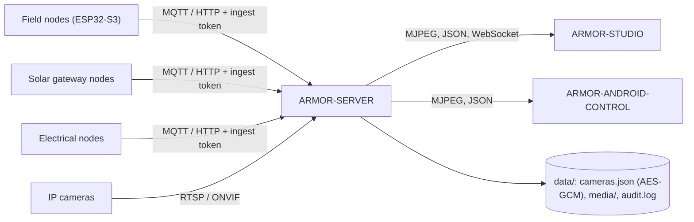

<p align="center">
  
</p>

# 🛡️ ARMOR-SERVER

<p align="center">
  <a href="README.md">🇺🇸 English</a> |
  <a href="README_spa.md">🇪🇸 Español</a> |
  <a href="README_fra.md">🇫🇷 Français</a> |
  <a href="README_ita.md">🇮🇹 Italiano</a> |
  🇩🇪 <b>Deutsch</b> |
  <a href="README_zho.md">🇨🇳 简体中文</a> |
  <a href="README_jpn.md">🇯🇵 日本語</a>
</p>

### Zentraler Sicherheitskoordinator: Telemetrie-Eingang, Alarme, Geräte, Solarmesswerte und Kamera-Gateway

<p align="center">
  
  
  
  
  
</p>

---

**Ehrlichkeitsprüfung - was heute läuft:** Jede Route, Sitzung, Verschlüsselung und Beweisregel unten ist real und durch Tests abgedeckt (`npm test`, 168 Tests, darunter eine vollständige HTTP-Integrationssuite gegen einen isolierten Server). Er lief gegen einen echten MQTT-Broker auf der CM5 (mit Skripten, nicht mit Feldknoten-Firmware) und hat Live-Video gestreamt, einen Schnappschuss gespeichert und von fünf echten IP-Kameras über FFmpeg aufgezeichnet. **Noch nicht belegt:** ONVIF mit einer echten ONVIF-Kamera, PTZ auf jeder Kamera-Firmware (es funktioniert an der Hi3510-Einheit), jede Jetson-Hardware und die Solar-Routen mit einem echten Gateway-Knoten (sie sind mit erzeugten Messwerten getestet).

---

## 🎯 Überblick

**ARMOR-SERVER** ist das vertrauenswürdige Zentrum von A.R.M.O.R. Feldknoten veröffentlichen Radar-, Licht- und Zustandsbeobachtungen; dieser Dienst validiert sie, hält den letzten bekannten Zustand jedes Knotens und stellt ihn der Studio-Konsole und dem Android-Client bereit. Er besitzt auch alles, was eine Kamera berührt, sodass **kein Browser und kein Telefon je ein Kamerapasswort oder eine RTSP-Adresse hält**.

* **Validierter Eingang:** HTTP- und MQTT-Beobachtungen werden an der Grenze geprüft (Kennung, Zeitstempel, Lux-Bereich, höchstens 15 Spuren), bevor sie die Zustandsprojektion erreichen.
* **Ehrlicher Knotenzustand:** ein Knoten, der verstummt, wird nach einem einstellbaren Fenster als *veraltet* und *offline* angezeigt, nie als online mit alten Daten. Unscharfschalten löscht eine hohe Warnung sofort.
* **Kamera-Gateway:** verschlüsselter Kamera-Tresor, ONVIF- / Hi3510- / PSIA-PTZ, RTSP-Pfadsuche, ein geteiltes FFmpeg-Relay je Kamera, Schnappschüsse und MP4-Aufnahme sowie ein Wächter, der eine Kamera, die nicht mehr antwortet, zu einem Ereignis und, scharf, zu einem Alarm macht.
* **Beweisbibliothek:** Aufbewahrung nach Alter und Größe, die ältesten zuerst, **geschützte Beweise**, die nie bereinigt werden, und ein SHA-256 für die Beweiskette. Eine Audit-Zeile je sicherheitsrelevanter Aktion, ohne Zugangsdaten.
* **Zustand, der überlebt:** der Sicherheitsmodus und die letzte Beobachtung jedes Knotens werden nach einem Neustart wiederhergestellt (ein Neustart schaltet den Perimeter nie stillschweigend unscharf). Jede Änderung von Warnstufe, Knotenzustand und Modus steht in einem Ereignisverlauf.
* **Alarmausgabe:** hohe Warnungen und, scharf, stumme oder Offline-Knoten gehen an MQTT `armor/server/alert` und einen optionalen HMAC-signierten Webhook; die Verweilzeit vor HIGH und Ignorierzonen stellt man in Studio ein.
* **Benutzer:** Namen und Passwörter (scrypt-Hashes), eine Rolle `admin`, die Benutzer verwaltet, und eine Rolle `operator`, die bedient; ein geändertes Passwort oder eine geänderte Rolle beendet die anderen Sitzungen dieses Benutzers.
* **Geräte, Alarme und Automatisierungen:** Rauch-, Gas-, Wasser-, Tür-, Fenster-, Bewegungs-, Klima-, Steckdosen-, Licht-, Sirenen- und Schlossgeräte über MQTT oder authentifizierten Push, mit normalisiertem Zustand, Verfügbarkeit und Befehlen; Alarme mit Lebenszyklus ausgelöst / quittiert / gelöscht; Regeln, die bei einem Ereignis Geräte schalten; Scharf- und Unscharfschalten aus einer angemeldeten Sitzung; und der Standortentwurf, für alle Clients auf dem Server gehalten.
* **Solarmesswerte:** Wechselrichter und Batteriestapel (mit jeder Zelle und den Kapazitäten) kommen per HTTP oder MQTT, werden vom gemeinsamen Vertrag validiert, mit Verlauf (ein Wert alle 30 s über einen Tag) und Summen gehalten, nach zwei Minuten als veraltet markiert und lösen vier Alarme aus (Wechselrichterstörung, Batterie schwach, Batteriealarm, Gerät stumm).
* **Die Maschine, das Netz und das Panel:** `GET /api/v1/system/metrics` (CPU, Speicher, Laufwerke, Temperatur, Netz und ein kurzer Verlauf der Maschine, auf der er läuft), `GET/PUT /api/v1/system/connection` (Adresse und Ports, auf denen er lauscht, nur für Administratoren, beim nächsten Start wirksam), `GET /api/v1/panel/summary` (wenige hundert Bytes für kleine Displays) und, für den Netzwerkknoten, die Zugänge, die ein Administrator für die Web-Verwaltung eines Geräts hinterlegt: verschlüsselt (AES-256-GCM), nie zurückgegeben und nur innerhalb des einen `inspect`-Auftrags übergeben, der sie braucht.

## 🔄 Architektur



## 🔒 Sicherheitsmodell

* Vier getrennte Geheimnisse: **Ingest** (Telemetrie, Zustand und Solarmesswerte senden), **Control** (Scharf-/Unscharfschalten, Ereignisse), **Operator** (Automatisierung) und der **Studio-Login**; jedes wird in konstanter Zeit verglichen und keines ersetzt ein anderes.
* Jede Route, die konfiguriert, bewegt, aufnimmt, aufzeichnet, schützt oder löscht, braucht einen Operator. Live-Video braucht einen Operator oder ein kurzlebiges, an eine Kamera gebundenes Stream-Ticket.
* Kamerapasswörter liegen nur in `data/cameras.json`, AES-256-GCM-verschlüsselt, und keine API gibt sie zurück; ONVIF-Adressen müssen auf dem Host der Kamera bleiben, Weiterleitungen werden abgelehnt.
* Studio-Sitzungen sind 8 Stunden lang HttpOnly und SameSite=Strict, die Anmeldung ist ratenbegrenzt und Fehler tragen nie einen Stacktrace.
* Der Server lauscht auf 127.0.0.1, außer `ARMOR_HOST` wird absichtlich gesetzt; dann wird ein Studio-Passwort unter 12 Zeichen abgelehnt.

## 🌐 API

* Öffentlich: `GET /healthz`. Für einen Operator: Status, Informationen, Kameras, Medien, Verlauf, Regeln, Geräte, Alarme, Automatisierungen, der Standortentwurf und `GET /api/v1/solar` mit Verlauf.
* Für Feldknoten und Gateways: `POST /api/v1/telemetry`, `/health`, `/solar` und `/electrical/readings` mit dem Ingest-Token sowie die MQTT-Topics `armor/node/#`, `armor/solar/#` und `armor/electrical/#`. Ereignisse erreichen die Konsolen über den WebSocket `/api/v1/events`.
* Jede Route, ihre Zugriffsregel und ihr Schema stehen in der OpenAPI-Datei von [ARMOR-COMMON](https://github.com/JuanenRac/ARMOR-COMMON), und ein Test prüft, dass keine Route fehlt.

## ⚙️ Konfiguration

* `.env.example` nach `.env` kopieren (von Git ignoriert) oder `run.bat` / `run.sh` beim ersten Lauf zufällige Geheimnisse erzeugen lassen.
* Pflicht: `ARMOR_INGEST_TOKEN` und `ARMOR_CONTROL_TOKEN` (24 Zeichen oder mehr, alle verschieden) und `ARMOR_STUDIO_USERNAME` / `ARMOR_STUDIO_PASSWORD` (der erste Administrator).
* Üblich: `ARMOR_HOST` / `ARMOR_PORT`, `ARMOR_DATA_DIR`, `ARMOR_FFMPEG_PATH` (Live-Video und Aufnahme), `ARMOR_MQTT_URL`, `ARMOR_STUDIO_ORIGIN`, `ARMOR_NODE_STALE_AFTER_S`, `ARMOR_CAMERA_CHECK_S`, `ARMOR_ALERT_DWELL_MS`, `ARMOR_ALERT_WEBHOOK_URL` und `ARMOR_COOKIE_SECURE` (hinter TLS auf `1`).

## 📂 Struktur des Repositorys

```text
ARMOR-SERVER/
├── src/            server, app, config, context, store, persistence, events, rules, notify, contracts, mqtt, audit,
│   │               alarms, automations, users, site, solar, solar_registry, electrical
│   ├── http/       auth primitives
│   ├── routes/     sessions, cameras, media, ingest, history, devices, alarms, users, solar, electrical, system
│   ├── devices/    the device model, kinds and MQTT bridge
│   ├── cameras/    model, vault, digest, ptz, rtsp, discovery, health, errors
│   └── media/      relay, evidence
├── tests/          unit tests + full HTTP integration suite
├── docs/           state machine, camera gateway, integration
├── data/           runtime state (ignored by Git)
└── images/         brand assets
```

## 🛠️ Entwicklungsumgebung

```powershell
npm install
npm run typecheck   # tsc --noEmit
npm test            # 168 tests: unit + full HTTP integration
npm run build       # dist/server.mjs
.\run.bat           # development server with hot reload
```

Zur Installation auf dem CM5-Prüfstand (isoliert von jedem anderen Projekt, eigener Benutzer, eigene Ports) siehe [ARMOR-DEVOPS](https://github.com/JuanenRac/ARMOR-DEVOPS).

## 🔗 Verwandte Projekte

**A.R.M.O.R.** (Autonomous Radar & Multimodal Observation Range) ist ein Perimeter-Sicherheitssystem aus unabhängigen Repositorys. Jedes hat eine eigene Version, eigene Tests und ein eigenes README; hier ist die Familie:

* **[ARMOR-COMMON](https://github.com/JuanenRac/ARMOR-COMMON)** - Nachrichtenverträge, Validierer, Konformitätsvektoren und generierte Typen
* **[ARMOR-RADAR](https://github.com/JuanenRac/ARMOR-RADAR)** - Feldknoten-Firmware für ESP32-S3 mit drei Radaren und eigenem Web-Panel
* **[ARMOR-SOLAR](https://github.com/JuanenRac/ARMOR-SOLAR)** - Protokolle für Solar-Wechselrichter und -Batterien und die Nachrichten eines Gateway-Knotens
* **[ARMOR-ELECTRICAL](https://github.com/JuanenRac/ARMOR-ELECTRICAL)** - Elektroknoten: Zähler, die Nachricht der Netzmesswerte und die Regeln fürs Schalten
* **[ARMOR-HMI](https://github.com/JuanenRac/ARMOR-HMI)** - Touch-Panel: der Systemzustand auf einem Wandbildschirm, Scharf- und Quittieren sowie das Zuhause des Sprachassistenten
* **[ARMOR-NETWORK](https://github.com/JuanenRac/ARMOR-NETWORK)** - Das lokale Netzwerk: seine Geräte, das Internet und was sich ändert
* **ARMOR-SERVER** (dieses Repository) - Zentraler Koordinator: Telemetrie, Alarme, Geräte, Solarmesswerte und Kameras
* **[ARMOR-STUDIO](https://github.com/JuanenRac/ARMOR-STUDIO)** - Web-Konsole: Kameras, Radar, Alarme, Solarenergie und 2D/3D-Standortdesigner
* **[ARMOR-ANDROID-CONTROL](https://github.com/JuanenRac/ARMOR-ANDROID-CONTROL)** - Android-Bedienclient mit Live-Radar in 2D/3D
* **[ARMOR-SERVER-AI](https://github.com/JuanenRac/ARMOR-SERVER-AI)** - Visuelle Inferenzrichtlinie, die ihre Entscheidungen erklärt und nie handelt
* **[ARMOR-VOICE-AI](https://github.com/JuanenRac/ARMOR-VOICE-AI)** - Offline-Sprachabsichten mit einer nicht fälschbaren Bestätigung
* **[ARMOR-HARDWARE](https://github.com/JuanenRac/ARMOR-HARDWARE)** - Gehäuse, Elektronik und die Abnahmematrix am Prüfstand
* **[ARMOR-DEVOPS](https://github.com/JuanenRac/ARMOR-DEVOPS)** - Bereitstellung, CM5-Prüfstand, Backup und TLS
* **[ARMOR-SIMULATOR](https://github.com/JuanenRac/ARMOR-SIMULATOR)** - Offline-Telemetriesimulator mit wiederholbaren Fehlern
* **[ARMOR-UPDATER](https://github.com/JuanenRac/ARMOR-UPDATER)** - Erkennt, installiert und aktualisiert die eigenen Repositories des Ökosystems
* **[ARMOR-DOCS](https://github.com/JuanenRac/ARMOR-DOCS)** - Architektur, Sicherheitsgrundlage und die Fähigkeitsmatrix

## 📚 Dokumentation und Community

Hier gibt es mehr zu lesen:

* [Fähigkeitsmatrix: was belegt ist und was nicht](https://github.com/JuanenRac/ARMOR-DOCS/blob/main/docs/CAPABILITY_MATRIX.md)
* [Projektkatalog: Versionen und wie die Repositorys voneinander abhängen](https://github.com/JuanenRac/ARMOR-DOCS/blob/main/docs/PROJECT_CATALOG.md)
* [Änderungsverlauf dieses Repositorys](CHANGELOG.md)
* [Lizenz (GPL-3.0-or-later)](LICENSE)
* Fragen, Ideen und Meldungen: electrohobby3d@gmail.com

## 👤 AUTOR

**JuanenRac (Electro Hobby 3D)** · electrohobby3d@gmail.com

## 📜 LIZENZ

GPL-3.0-or-later - siehe [LICENSE](LICENSE).
