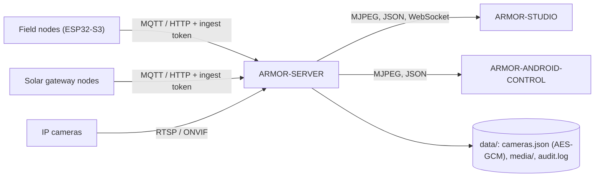

<p align="center">
  
</p>

# 🛡️ ARMOR-SERVER

<p align="center">
  <a href="README.md">🇺🇸 English</a> |
  <a href="README_spa.md">🇪🇸 Español</a> |
  🇫🇷 <b>Français</b> |
  <a href="README_ita.md">🇮🇹 Italiano</a> |
  <a href="README_deu.md">🇩🇪 Deutsch</a> |
  <a href="README_zho.md">🇨🇳 简体中文</a> |
  <a href="README_jpn.md">🇯🇵 日本語</a>
</p>

### Coordinateur central de sécurité : entrée de télémétrie, alarmes, appareils, relevés solaires et passerelle de caméras

<p align="center">
  
  
  
  
  
</p>

---

**Vérification d'honnêteté - ce qui fonctionne aujourd'hui:** Chaque route, session, chiffrement et règle de preuves ci-dessous est réel et couvert par des tests (`npm test`, 159 tests, dont une suite d'intégration HTTP complète face à un serveur isolé). Il a fonctionné avec un vrai broker MQTT sur la CM5 (avec des scripts, pas avec un firmware de nœud de terrain), a diffusé de la vidéo en direct, enregistré une capture et filmé depuis cinq vraies caméras IP via FFmpeg. Ce qui n'est **pas encore prouvé** : ONVIF avec une vraie caméra ONVIF, le PTZ sur chaque firmware de caméra (il marche sur l'unité Hi3510), tout matériel Jetson et les routes solaires avec un vrai nœud passerelle (elles sont testées avec des relevés générés).

---

## 🎯 Présentation

**ARMOR-SERVER** est le centre de confiance d'A.R.M.O.R. Les nœuds de terrain publient des observations de radar, de lumière et de santé ; ce service les valide, garde le dernier état connu de chaque nœud et le sert à la console Studio et au client Android. Il possède aussi tout ce qui touche une caméra, de sorte qu'**aucun navigateur ni téléphone ne détient jamais un mot de passe de caméra ni une adresse RTSP**.

* **Entrée validée :** les observations HTTP et MQTT sont vérifiées à la frontière (identifiant, horodatages, plage de lux, 15 pistes au plus) avant d'atteindre la projection d'état.
* **État honnête des nœuds :** un nœud qui se tait est affiché *périmé* puis *hors ligne* après un délai configurable, jamais en ligne sur de vieilles données. Désarmer efface aussitôt une alerte haute.
* **Passerelle de caméras :** coffre de caméras chiffré, PTZ ONVIF / Hi3510 / PSIA, découverte des chemins RTSP, un relais FFmpeg partagé par caméra, captures et enregistrement MP4, et un chien de garde qui transforme une caméra muette en événement et, armé, en alarme.
* **Bibliothèque de preuves :** rétention par âge et par taille en commençant par les plus anciennes, **preuves protégées** jamais supprimées, et un SHA-256 pour la chaîne de conservation. Une ligne d'audit par action pertinente pour la sécurité, sans identifiants.
* **État qui survit :** le mode de sécurité et la dernière observation de chaque nœud sont restaurés après un redémarrage (un redémarrage ne désarme jamais le périmètre en silence). Chaque changement de niveau d'alerte, d'état de nœud et de mode est gardé dans un historique d'événements.
* **Sortie d'alarme :** les alertes hautes et, armé, les nœuds muets ou hors ligne vont vers MQTT `armor/server/alert` et un webhook facultatif signé HMAC ; le délai avant HIGH et les zones ignorées se règlent depuis Studio.
* **Utilisateurs :** noms et mots de passe (hachages scrypt), un rôle `admin` qui gère les utilisateurs et un rôle `operator` qui opère ; changer un mot de passe ou un rôle ferme les autres sessions de cet utilisateur.
* **Appareils, alarmes et automatisations :** appareils de fumée, gaz, inondation, porte, fenêtre, mouvement, climat, prise, lumière, sirène et serrure par MQTT ou envoi authentifié, avec état normalisé, disponibilité et commandes ; alarmes avec un cycle déclenchée / acquittée / effacée ; règles qui commandent des appareils lors d'un événement ; armer et désarmer depuis une session ouverte ; et le plan du site gardé sur le serveur pour tous les clients.
* **Relevés solaires :** les onduleurs et piles de batteries (avec chaque cellule et les capacités) arrivent par HTTP ou MQTT, sont validés par le contrat partagé, gardés avec un historique (un échantillon toutes les 30 s pendant un jour) et des totaux, marqués périmés après deux minutes, et déclenchent quatre alarmes (panne d'onduleur, batterie faible, alarme de batterie, appareil muet).

## 🔄 Architecture



## 🔒 Modèle de sécurité

* Quatre secrets séparés : **ingestion** (envoi de télémétrie, santé et relevés solaires), **contrôle** (armer / désarmer, événements), **opérateur** (automatisation) et **connexion à Studio** ; chacun est comparé en temps constant et aucun ne remplace un autre.
* Toute route qui configure, déplace, capture, enregistre, protège ou supprime exige un opérateur. La vidéo en direct exige un opérateur ou un ticket de flux de courte durée lié à une caméra.
* Les mots de passe des caméras ne vivent que dans `data/cameras.json`, chiffrés en AES-256-GCM, et aucune API ne les renvoie ; les adresses ONVIF doivent rester sur l'hôte de la caméra et les redirections sont refusées.
* Les sessions Studio sont HttpOnly et SameSite=Strict pendant 8 heures, la connexion est limitée en débit et les erreurs ne portent jamais de trace de pile.
* Le serveur écoute sur 127.0.0.1 sauf si `ARMOR_HOST` est défini volontairement, et alors un mot de passe Studio de moins de 12 caractères est refusé.

## 🌐 API

* Publique : `GET /healthz`. Pour un opérateur : état, informations, caméras, médias, historique, règles, appareils, alarmes, automatisations, plan du site et `GET /api/v1/solar` avec son historique.
* Pour les nœuds de terrain et les passerelles : `POST /api/v1/telemetry`, `/health` et `/solar` avec le jeton d'ingestion, et les sujets MQTT `armor/node/#` et `armor/solar/#`. Les événements atteignent les consoles par le WebSocket `/api/v1/events`.
* Chaque route, sa règle d'accès et son schéma sont dans le fichier OpenAPI d'[ARMOR-COMMON](../ARMOR-COMMON), et un test vérifie qu'aucune route n'y manque.

## ⚙️ Configuration

* Copiez `.env.example` vers `.env` (ignoré par Git), ou laissez `run.bat` / `run.sh` générer des secrets aléatoires au premier lancement.
* Obligatoires : `ARMOR_INGEST_TOKEN` et `ARMOR_CONTROL_TOKEN` (24 caractères ou plus, tous différents) et `ARMOR_STUDIO_USERNAME` / `ARMOR_STUDIO_PASSWORD` (le premier administrateur).
* Courantes : `ARMOR_HOST` / `ARMOR_PORT`, `ARMOR_DATA_DIR`, `ARMOR_FFMPEG_PATH` (vidéo en direct et capture), `ARMOR_MQTT_URL`, `ARMOR_STUDIO_ORIGIN`, `ARMOR_NODE_STALE_AFTER_S`, `ARMOR_CAMERA_CHECK_S`, `ARMOR_ALERT_DWELL_MS`, `ARMOR_ALERT_WEBHOOK_URL` et `ARMOR_COOKIE_SECURE` (à `1` derrière TLS).

## 📂 Structure du dépôt

```text
ARMOR-SERVER/
├── src/            server, app, config, context, store, persistence, events, rules, notify, contracts, mqtt, audit,
│   │               alarms, automations, users, site, solar
│   ├── http/       auth primitives
│   ├── routes/     sessions, cameras, media, ingest, history, devices, alarms, automations, site, solar
│   ├── devices/    the device model, kinds and MQTT bridge
│   ├── cameras/    model, vault, digest, ptz, rtsp, discovery, health, errors
│   └── media/      relay, evidence
├── tests/          unit tests + full HTTP integration suite
├── docs/           state machine, camera gateway, integration
├── data/           runtime state (ignored by Git)
└── images/         brand assets
```

## 🛠️ Environnement de développement

```powershell
npm install
npm run typecheck   # tsc --noEmit
npm test            # 159 tests: unit + full HTTP integration
npm run build       # dist/server.mjs
.\run.bat           # development server with hot reload
```

Pour installer sur le banc d'essai CM5 (isolé de tout autre projet, avec utilisateur et ports propres), voir [ARMOR-DEVOPS](../ARMOR-DEVOPS).

## 🔗 Projets liés

**A.R.M.O.R.** (Autonomous Radar & Multimodal Observation Range) est un système de sécurité périmétrique composé de dépôts indépendants. Chacun a sa propre version, ses propres tests et son propre README ; voici la famille :

* **[ARMOR-COMMON](../ARMOR-COMMON)** - Contrats de messages, validateurs, vecteurs de conformité et types générés
* **[ARMOR-RADAR](../ARMOR-RADAR)** - Firmware du nœud de terrain pour ESP32-S3 avec trois radars et son propre panneau web
* **[ARMOR-SOLAR](../ARMOR-SOLAR)** - Protocoles des onduleurs et batteries solaires et messages d'un nœud passerelle
* **ARMOR-SERVER** (ce dépôt) - Coordinateur central : télémétrie, alarmes, appareils, relevés solaires et caméras
* **[ARMOR-STUDIO](../ARMOR-STUDIO)** - Console web : caméras, radar, alarmes, énergie solaire et concepteur de site 2D/3D
* **[ARMOR-ANDROID-CONTROL](../ARMOR-ANDROID-CONTROL)** - Client Android de l'opérateur avec radar 2D/3D en direct
* **[ARMOR-SERVER-AI](../ARMOR-SERVER-AI)** - Politique d'inférence visuelle qui explique ses décisions et n'agit jamais
* **[ARMOR-VOICE-AI](../ARMOR-VOICE-AI)** - Intentions vocales hors ligne avec une confirmation impossible à falsifier
* **[ARMOR-HARDWARE](../ARMOR-HARDWARE)** - Boîtiers, électronique et matrice d'acceptation sur banc
* **[ARMOR-DEVOPS](../ARMOR-DEVOPS)** - Déploiement, banc d'essai CM5, sauvegarde et TLS
* **[ARMOR-SIMULATOR](../ARMOR-SIMULATOR)** - Simulateur de télémétrie hors ligne avec des pannes reproductibles
* **[ARMOR-DOCS](../ARMOR-DOCS)** - Architecture, base de sécurité et matrice des capacités

## 📚 Documentation et communauté

Pour en savoir plus :

* [Matrice des capacités : ce qui est prouvé et ce qui ne l'est pas](../ARMOR-DOCS/docs/CAPABILITY_MATRIX.md)
* [Catalogue des projets : versions et dépendances entre les dépôts](../ARMOR-DOCS/docs/PROJECT_CATALOG.md)
* [Historique des modifications de ce dépôt](CHANGELOG.md)
* [Licence (GPL-3.0-or-later)](LICENSE)
* Questions, idées et rapports : electrohobby3d@gmail.com

## 👤 AUTEUR

**JuanenRac (Electro Hobby 3D)** · electrohobby3d@gmail.com

## 📜 LICENCE

GPL-3.0-or-later - voir [LICENSE](LICENSE).
