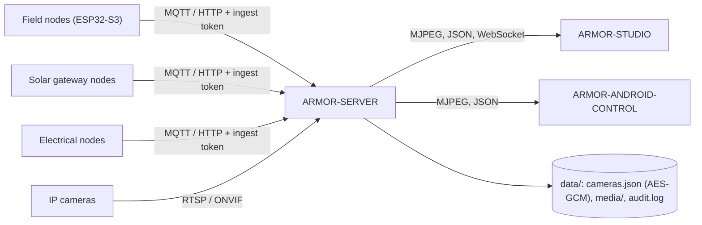

<p align="center">
  
</p>

# 🛡️ ARMOR-SERVER

<p align="center">
  <a href="README.md">🇺🇸 English</a> |
  <a href="README_spa.md">🇪🇸 Español</a> |
  <a href="README_fra.md">🇫🇷 Français</a> |
  🇮🇹 <b>Italiano</b> |
  <a href="README_deu.md">🇩🇪 Deutsch</a> |
  <a href="README_zho.md">🇨🇳 简体中文</a> |
  <a href="README_jpn.md">🇯🇵 日本語</a>
</p>

### Coordinatore centrale di sicurezza: ingresso della telemetria, allarmi, dispositivi, letture solari e gateway delle telecamere

<p align="center">
  
  
  
  
  
</p>

---

**Controllo di onestà - cosa funziona oggi:** Ogni rotta, sessione, cifratura e regola delle prove qui sotto è reale e coperta da test (`npm test`, 168 test, con una suite di integrazione HTTP completa contro un server isolato). Ha funzionato con un vero broker MQTT sulla CM5 (con script, non con il firmware di un nodo di campo), ha trasmesso video dal vivo, salvato un'istantanea e registrato da cinque vere telecamere IP tramite FFmpeg. Ciò che **non è ancora provato**: ONVIF con una vera telecamera ONVIF, il PTZ su ogni firmware di telecamera (funziona sull'unità Hi3510), qualunque hardware Jetson e le rotte solari con un vero nodo gateway (sono testate con letture generate).

---

## 🎯 Panoramica

**ARMOR-SERVER** è il centro di fiducia di A.R.M.O.R. I nodi di campo pubblicano osservazioni di radar, luce e salute; questo servizio le valida, conserva l'ultimo stato noto di ogni nodo e lo serve alla console Studio e al client Android. Possiede anche tutto ciò che tocca una telecamera, così **nessun browser né telefono detiene mai una password di telecamera o un indirizzo RTSP**.

* **Ingresso validato:** le osservazioni HTTP e MQTT sono controllate al confine (identificatore, timestamp, intervallo di lux, al massimo 15 tracce) prima di raggiungere la proiezione di stato.
* **Stato onesto dei nodi:** un nodo che smette di parlare è mostrato come *obsoleto* e poi *offline* dopo una finestra configurabile, mai online su dati vecchi. Disinserire cancella subito un avviso alto.
* **Gateway delle telecamere:** cassaforte di telecamere cifrata, PTZ ONVIF / Hi3510 / PSIA, scoperta dei percorsi RTSP, un relay FFmpeg condiviso per telecamera, istantanee e registrazione MP4, e un watchdog che trasforma una telecamera muta in un evento e, a sistema inserito, in un allarme.
* **Libreria delle prove:** conservazione per età e dimensione partendo dalle più vecchie, **prove protette** mai eliminate e uno SHA-256 per la catena di custodia. Una riga di audit per ogni azione rilevante per la sicurezza, senza credenziali.
* **Stato che sopravvive:** la modalità di sicurezza e l'ultima osservazione di ogni nodo sono ripristinate dopo un riavvio (un riavvio non disinserisce mai il perimetro in silenzio). Ogni cambio di livello di avviso, di stato del nodo e di modalità resta in una cronologia degli eventi.
* **Uscita di allarme:** gli avvisi alti e, a sistema inserito, i nodi muti o offline vanno a MQTT `armor/server/alert` e a un webhook opzionale firmato HMAC; il tempo di permanenza prima di HIGH e le zone ignorate si regolano da Studio.
* **Utenti:** nomi e password (hash scrypt), un ruolo `admin` che gestisce gli utenti e un ruolo `operator` che opera; cambiare una password o un ruolo chiude le altre sessioni di quell'utente.
* **Dispositivi, allarmi e automazioni:** dispositivi di fumo, gas, allagamento, porta, finestra, movimento, clima, presa, luce, sirena e serratura via MQTT o invio autenticato, con stato normalizzato, disponibilità e comandi; allarmi con ciclo generato / riconosciuto / cancellato; regole che comandano dispositivi quando succede qualcosa; inserire e disinserire da una sessione aperta; e il progetto del sito conservato sul server per tutti i client.
* **Letture solari:** inverter e pacchi di batterie (con ogni cella e le capacità) arrivano via HTTP o MQTT, sono validati dal contratto condiviso, conservati con una cronologia (un campione ogni 30 s per un giorno) e totali, segnati come obsoleti dopo due minuti, e generano quattro allarmi (guasto dell'inverter, batteria scarica, allarme della batteria, dispositivo muto).

## 🔄 Architettura



## 🔒 Modello di sicurezza

* Quattro segreti separati: **ingestione** (invio di telemetria, salute e letture solari), **controllo** (inserire / disinserire, eventi), **operatore** (automazione) e **accesso a Studio**; ciascuno è confrontato a tempo costante e nessuno sostituisce un altro.
* Ogni rotta che configura, muove, cattura, registra, protegge o elimina richiede un operatore. Il video dal vivo richiede un operatore o un ticket di flusso di breve durata legato a una telecamera.
* Le password delle telecamere vivono solo in `data/cameras.json`, cifrate con AES-256-GCM, e nessuna API le restituisce; gli indirizzi ONVIF devono restare sull'host della telecamera e i reindirizzamenti sono rifiutati.
* Le sessioni di Studio sono HttpOnly e SameSite=Strict per 8 ore, l'accesso ha un limite di frequenza e gli errori non portano mai una traccia dello stack.
* Il server ascolta su 127.0.0.1 a meno che `ARMOR_HOST` sia impostato di proposito, e allora una password di Studio più corta di 12 caratteri è rifiutata.

## 🌐 API

* Pubblica: `GET /healthz`. Per un operatore: stato, informazioni, telecamere, media, cronologia, regole, dispositivi, allarmi, automazioni, progetto del sito e `GET /api/v1/solar` con la sua cronologia.
* Per i nodi di campo e i gateway: `POST /api/v1/telemetry`, `/health`, `/solar` e `/electrical/readings` con il token di ingestione, e i topic MQTT `armor/node/#`, `armor/solar/#` e `armor/electrical/#`. Gli eventi raggiungono le console dal WebSocket `/api/v1/events`.
* Ogni rotta, la sua regola di accesso e il suo schema sono nel file OpenAPI di [ARMOR-COMMON](../ARMOR-COMMON), e un test verifica che non ne manchi nessuna.

## ⚙️ Configurazione

* Copia `.env.example` in `.env` (ignorato da Git), oppure lascia che `run.bat` / `run.sh` generi segreti casuali alla prima esecuzione.
* Obbligatorie: `ARMOR_INGEST_TOKEN` e `ARMOR_CONTROL_TOKEN` (24 caratteri o più, tutte diverse) e `ARMOR_STUDIO_USERNAME` / `ARMOR_STUDIO_PASSWORD` (il primo amministratore).
* Comuni: `ARMOR_HOST` / `ARMOR_PORT`, `ARMOR_DATA_DIR`, `ARMOR_FFMPEG_PATH` (video dal vivo e cattura), `ARMOR_MQTT_URL`, `ARMOR_STUDIO_ORIGIN`, `ARMOR_NODE_STALE_AFTER_S`, `ARMOR_CAMERA_CHECK_S`, `ARMOR_ALERT_DWELL_MS`, `ARMOR_ALERT_WEBHOOK_URL` e `ARMOR_COOKIE_SECURE` (a `1` dietro TLS).

## 📂 Struttura del repository

```text
ARMOR-SERVER/
├── src/            server, app, config, context, store, persistence, events, rules, notify, contracts, mqtt, audit,
│   │               alarms, automations, users, site, solar, solar_registry, electrical
│   ├── http/       auth primitives
│   ├── routes/     sessions, cameras, media, ingest, history, devices, alarms, users, solar, electrical, system
│   ├── devices/    the device model, kinds and MQTT bridge
│   ├── cameras/    model, vault, digest, ptz, rtsp, discovery, health, errors
│   └── media/      relay, evidence
├── tests/          unit tests + full HTTP integration suite
├── docs/           state machine, camera gateway, integration
├── data/           runtime state (ignored by Git)
└── images/         brand assets
```

## 🛠️ Ambiente di sviluppo

```powershell
npm install
npm run typecheck   # tsc --noEmit
npm test            # 168 tests: unit + full HTTP integration
npm run build       # dist/server.mjs
.\run.bat           # development server with hot reload
```

Per installare sul banco di prova CM5 (isolato da ogni altro progetto, con utente e porte proprie) vedi [ARMOR-DEVOPS](../ARMOR-DEVOPS).

## 🔗 Progetti correlati

**A.R.M.O.R.** (Autonomous Radar & Multimodal Observation Range) è un sistema di sicurezza perimetrale fatto di repository indipendenti. Ognuno ha la propria versione, i propri test e il proprio README; ecco la famiglia:

* **[ARMOR-COMMON](../ARMOR-COMMON)** - Contratti dei messaggi, validatori, vettori di conformità e tipi generati
* **[ARMOR-RADAR](../ARMOR-RADAR)** - Firmware del nodo di campo per ESP32-S3 con tre radar e un proprio pannello web
* **[ARMOR-SOLAR](../ARMOR-SOLAR)** - Protocolli di inverter e batterie solari e messaggi di un nodo gateway
* **[ARMOR-ELECTRICAL](../ARMOR-ELECTRICAL)** - Nodo elettrico: contatori, il messaggio delle letture della rete e le regole di manovra
* **[ARMOR-NETWORK](../ARMOR-NETWORK)** - La rete locale: i suoi dispositivi, internet e ciò che cambia
* **ARMOR-SERVER** (questo repository) - Coordinatore centrale: telemetria, allarmi, dispositivi, letture solari e telecamere
* **[ARMOR-STUDIO](../ARMOR-STUDIO)** - Console web: telecamere, radar, allarmi, energia solare e progettista del sito 2D/3D
* **[ARMOR-ANDROID-CONTROL](../ARMOR-ANDROID-CONTROL)** - Client Android dell'operatore con radar 2D/3D in tempo reale
* **[ARMOR-SERVER-AI](../ARMOR-SERVER-AI)** - Politica di inferenza visiva che spiega le sue decisioni e non agisce mai
* **[ARMOR-VOICE-AI](../ARMOR-VOICE-AI)** - Intenti vocali offline con una conferma impossibile da falsificare
* **[ARMOR-HARDWARE](../ARMOR-HARDWARE)** - Contenitori, elettronica e matrice di accettazione da banco
* **[ARMOR-DEVOPS](../ARMOR-DEVOPS)** - Distribuzione, banco di prova CM5, backup e TLS
* **[ARMOR-SIMULATOR](../ARMOR-SIMULATOR)** - Simulatore di telemetria offline con guasti ripetibili
* **[ARMOR-DOCS](../ARMOR-DOCS)** - Architettura, base di sicurezza e matrice delle capacità

## 📚 Documentazione e comunità

Dove leggere di più:

* [Matrice delle capacità: cosa è provato e cosa no](../ARMOR-DOCS/docs/CAPABILITY_MATRIX.md)
* [Catalogo dei progetti: versioni e dipendenze tra i repository](../ARMOR-DOCS/docs/PROJECT_CATALOG.md)
* [Cronologia delle modifiche di questo repository](CHANGELOG.md)
* [Licenza (GPL-3.0-or-later)](LICENSE)
* Domande, idee e segnalazioni: electrohobby3d@gmail.com

## 👤 AUTORE

**JuanenRac (Electro Hobby 3D)** · electrohobby3d@gmail.com

## 📜 LICENZA

GPL-3.0-or-later - vedi [LICENSE](LICENSE).
