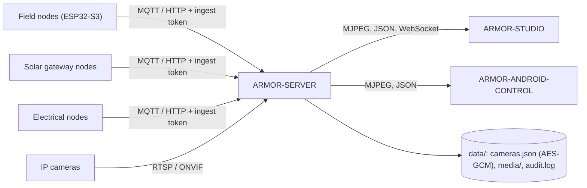

<p align="center">
  
</p>

# 🛡️ ARMOR-SERVER

<p align="center">
  <a href="README.md">🇺🇸 English</a> |
  <a href="README_spa.md">🇪🇸 Español</a> |
  <a href="README_fra.md">🇫🇷 Français</a> |
  <a href="README_ita.md">🇮🇹 Italiano</a> |
  <a href="README_deu.md">🇩🇪 Deutsch</a> |
  <a href="README_zho.md">🇨🇳 简体中文</a> |
  🇯🇵 <b>日本語</b>
</p>

### 中央セキュリティコーディネーター：テレメトリの受け口、アラーム、デバイス、太陽光の測定値、カメラゲートウェイ

<p align="center">
  
  
  
  
  
</p>

---

**正直さのチェック - 今日動いているもの:** 以下のすべてのルート、セッション、暗号化、証拠の規則は実在し、テストで網羅されています（`npm test`、272 件。隔離したサーバーに対する完全な HTTP 統合テストを含む）。CM5 上の実際の MQTT ブローカーに対して動作し（スクリプトと 2 台の実際のレーダーノードによる）、5 台の実際の IP カメラから FFmpeg でライブ映像の配信、スナップショットの保存、録画を行いました。**まだ実証されていないもの：** 実際の ONVIF カメラでの ONVIF、すべてのカメラファームウェアでの PTZ（Hi3510 の機種では動作します）、Jetson ハードウェア全般、そして実際のゲートウェイノードでの太陽光ルート（生成した測定値でテストしています）。

---

## 🎯 概要

**ARMOR-SERVER** は A.R.M.O.R. の信頼の中心です。フィールドノードがレーダー、光、ヘルスの観測を発行し、このサービスがそれを検証し、各ノードの最後に分かっている状態を保持して、Studio コンソールと Android クライアントに提供します。カメラに触れるすべてもここが持つので、**ブラウザーもスマートフォンもカメラのパスワードや RTSP アドレスを持つことはありません**。

* **検証済みの入口：** HTTP と MQTT の観測は境界で検査され（識別子、タイムスタンプ、lux の範囲、トラックは最大 15 件）、その後で状態の投影に入ります。
* **正直なノードの状態：** 話さなくなったノードは、設定可能な時間の後に*期限切れ*、そして*オフライン*と表示され、古いデータでオンラインと表示されることはありません。解除すると高レベルの警告はすぐに消えます。
* **カメラゲートウェイ：** 暗号化されたカメラ金庫、ONVIF / Hi3510 / PSIA の PTZ、RTSP パスの探索、カメラごとに共有される 1 つの FFmpeg リレー、スナップショットと MP4 録画、そして応答しなくなったカメラをイベントに、警戒中ならアラームにする監視。
* **証拠ライブラリ：** 古いものから、期間とサイズで保持。消されない**保護された証拠**と、保全の連鎖のための SHA-256。セキュリティに関わる操作ごとに認証情報を除いた監査の 1 行。
* **残る状態：** セキュリティモードと各ノードの最後の観測は再起動後に復元されます（再起動で周辺が黙って解除されることはありません）。警告レベル、ノードの状態、モードのすべての変化はイベント履歴に残ります。
* **アラーム出力：** 高レベルの警告と、警戒中の沈黙またはオフラインのノードは、MQTT `armor/server/alert` とオプションの HMAC 署名付き Webhook に送られます。HIGH までの滞留時間と無視ゾーンは Studio で調整します。
* **ユーザー：** 名前とパスワード（scrypt ハッシュ）、ユーザーを管理する `admin` ロールと操作する `operator` ロール。パスワードやロールを変えると、そのユーザーの他のセッションは終了します。
* **デバイス、アラーム、自動化：** 煙、ガス、浸水、ドア、窓、動き、気候、プラグ、照明、サイレン、鍵のデバイスを MQTT または認証付きプッシュで扱い、正規化された状態、可用性、コマンドを持ちます。発生 / 確認済み / 解消のライフサイクルを持つアラーム。出来事に応じてデバイスを切り替える規則。サインイン済みセッションからの警戒と解除。そしてすべてのクライアントのためにサーバーに保存されるサイト設計。
* **太陽光の測定値：** インバーターとバッテリースタック（各セルと容量を含む）が HTTP または MQTT で届き、共有の契約で検証され、履歴（1 日分を 30 s ごとに 1 サンプル）と合計とともに保持され、2 分後に期限切れとされ、4 種類のアラーム（インバーターの故障、バッテリー残量低下、バッテリーのアラーム、デバイスの沈黙）を上げます。
* **マシン、ネットワーク、パネル：** `GET /api/v1/system/metrics`（稼働マシンのCPU、メモリ、ディスク、温度、ネットワークと短い履歴）、`GET/PUT /api/v1/system/connection`（待ち受けアドレスとポート、管理者のみ、次回起動時に反映）、`GET /api/v1/panel/summary`（小型画面向けの数百バイト）、そしてネットワークノード向けに、管理者がデバイスのWeb管理用に保存するログイン：暗号化（AES-256-GCM）され、返されることはなく、必要な `inspect` 命令の中でのみ渡されます。

## 🔄 アーキテクチャ



## 🔒 セキュリティモデル

* 4 つの別々のシークレット：**取り込み**（テレメトリ、ヘルス、太陽光の測定値の送信）、**制御**（警戒 / 解除、イベント）、**オペレーター**（自動化）、**Studio ログイン**。それぞれ定数時間で比較され、他の代わりにはなりません。
* 設定、移動、撮影、録画、保護、削除を行うルートはすべてオペレーターが必要です。ライブ映像にはオペレーターか、1 台のカメラに結び付いた短命のストリームチケットが必要です。
* カメラのパスワードは `data/cameras.json` にのみ AES-256-GCM で暗号化して保存され、どの API も返しません。ONVIF アドレスはカメラのホスト内に限られ、リダイレクトは拒否されます。
* Studio のセッションは 8 時間、HttpOnly かつ SameSite=Strict で、ログインには回数制限があり、エラーにスタックトレースが載ることはありません。
* サーバーは、`ARMOR_HOST` を意図的に設定しない限り 127.0.0.1 で待ち受けます。設定した場合は 12 文字未満の Studio パスワードは拒否されます。

## 🌐 API

* 公開：`GET /healthz`。オペレーター向け：状態、情報、カメラ、メディア、履歴、規則、デバイス、アラーム、自動化、サイト設計、履歴付きの `GET /api/v1/solar`。
* フィールドノードとゲートウェイ向け：取り込みトークンを使う `POST /api/v1/telemetry`、`/health`、`/solar`、`/electrical/readings` と、MQTT トピック `armor/node/#`、`armor/solar/#`、`armor/electrical/#`。イベントは WebSocket `/api/v1/events` でコンソールに届きます。
* すべてのルート、そのアクセス規則、スキーマは [ARMOR-COMMON](https://github.com/JuanenRac/ARMOR-COMMON) の OpenAPI ファイルにあり、漏れがないことをテストが確認します。

## ⚙️ 設定

* `.env.example` を `.env`（Git は無視）にコピーするか、`run.bat` / `run.sh` に初回実行でランダムなシークレットを生成させます。
* 必須：`ARMOR_INGEST_TOKEN` と `ARMOR_CONTROL_TOKEN`（24 文字以上、すべて異なる）、および `ARMOR_STUDIO_USERNAME` / `ARMOR_STUDIO_PASSWORD`（最初の管理者）。
* よく使う：`ARMOR_HOST` / `ARMOR_PORT`、`ARMOR_DATA_DIR`、`ARMOR_FFMPEG_PATH`（ライブ映像と撮影）、`ARMOR_MQTT_URL`、`ARMOR_STUDIO_ORIGIN`、`ARMOR_NODE_STALE_AFTER_S`、`ARMOR_CAMERA_CHECK_S`、`ARMOR_ALERT_DWELL_MS`、`ARMOR_ALERT_WEBHOOK_URL`、`ARMOR_COOKIE_SECURE`（TLS の背後では `1`）。
* **ファームウェア、通知、音声：** サーバーは現場ノードのファームウェアを更新し（ファイルまたは GitHub のリリース、1 台または種類ごとの全ノード、進捗表示と SHA-256 の確認付き）、アラームを Telegram と Home Assistant に送り（再試行あり、秘密を含まない監査行、7 言語）、音声ゲートウェイ経由で 15 個の文字または音声のコマンド（状態、アラーム、ノード、カメラ、レーダー、太陽光と電気のシステム、ネットワーク、時刻、ヘルプ、照明。警戒と解除は 2 回目のターンで確認）を実行します。観測サービスは専用のトークンで `camera_motion` を上げます。[ノードのファームウェア](docs/NODE_FIRMWARE.md)と[統合](docs/INTEGRATION.md)を参照。

## 📂 リポジトリの構成

```text
ARMOR-SERVER/
├── src/            server, app, config, context, store, persistence, events, rules, notify, contracts, mqtt, audit,
│   │               alarms, automations, users, site, solar, solar_registry, electrical
│   ├── http/       auth primitives
│   ├── routes/     sessions, cameras, media, ingest, history, devices, alarms, users, solar, electrical, system
│   ├── devices/    the device model, kinds and MQTT bridge
│   ├── cameras/    model, vault, digest, ptz, rtsp, discovery, health, errors
│   └── media/      relay, evidence
├── tests/          unit tests + full HTTP integration suite
├── docs/           state machine, camera gateway, integration
├── data/           runtime state (ignored by Git)
└── images/         brand assets
```

## 🛠️ 開発環境

```powershell
npm install
npm run typecheck   # tsc --noEmit
npm test            # 272 tests: unit + full HTTP integration
npm run build       # dist/server.mjs
.\run.bat           # development server with hot reload
```

CM5 テストベンチ（他のすべてのプロジェクトから隔離され、専用のユーザーとポートを持つ）へのインストールは [ARMOR-DEVOPS](https://github.com/JuanenRac/ARMOR-DEVOPS) を参照。

## 🔗 関連プロジェクト

**A.R.M.O.R.**（Autonomous Radar & Multimodal Observation Range）は、独立したリポジトリで構成される周辺警備システムです。それぞれに独自のバージョン、テスト、README があります。ファミリーは次のとおりです：

* **[ARMOR-COMMON](https://github.com/JuanenRac/ARMOR-COMMON)** - メッセージ契約、検証器、適合性ベクトル、生成された型
* **[ARMOR-RADAR](https://github.com/JuanenRac/ARMOR-RADAR)** - ESP32-S3 用フィールドノードのファームウェア。レーダー 3 基と独自の Web パネル付き
* **[ARMOR-SOLAR](https://github.com/JuanenRac/ARMOR-SOLAR)** - 太陽光インバーターとバッテリーのプロトコル、およびゲートウェイノードのメッセージ
* **[ARMOR-ELECTRICAL](https://github.com/JuanenRac/ARMOR-ELECTRICAL)** - 電気ノード：電力量計、電力網の計測メッセージ、開閉のルール
* **[ARMOR-ALARM](https://github.com/JuanenRac/ARMOR-ALARM)** - 警報ノードと警報盤：警戒区域、警戒セット、遅延、サイレン、PIN。サーバーがあってもなくても
* **[ARMOR-HMI](https://github.com/JuanenRac/ARMOR-HMI)** - タッチパネル：壁面ディスプレイでのシステム状態表示、警戒・確認操作、音声アシスタントの拠点
* **[ARMOR-NETWORK](https://github.com/JuanenRac/ARMOR-NETWORK)** - ローカルネットワーク：機器、インターネット、そして変化
* **ARMOR-SERVER** (このリポジトリ) - 中央コーディネーター：テレメトリ、アラーム、デバイス、太陽光の測定値、カメラ
* **[ARMOR-STUDIO](https://github.com/JuanenRac/ARMOR-STUDIO)** - Web コンソール：カメラ、レーダー、アラーム、太陽光発電、2D/3D サイト設計
* **[ARMOR-ANDROID-CONTROL](https://github.com/JuanenRac/ARMOR-ANDROID-CONTROL)** - リアルタイム 2D/3D レーダー付きの Android オペレータークライアント
* **[ARMOR-SERVER-AI](https://github.com/JuanenRac/ARMOR-SERVER-AI)** - 判断を説明し、決して動作しない視覚推論ポリシー
* **[ARMOR-VOICE-AI](https://github.com/JuanenRac/ARMOR-VOICE-AI)** - 偽造できない確認を備えたオフライン音声インテント
* **[ARMOR-HARDWARE](https://github.com/JuanenRac/ARMOR-HARDWARE)** - 筐体、電子部品、ベンチ受け入れマトリクス
* **[ARMOR-DEVOPS](https://github.com/JuanenRac/ARMOR-DEVOPS)** - デプロイ、CM5 テストベンチ、バックアップ、TLS
* **[ARMOR-SIMULATOR](https://github.com/JuanenRac/ARMOR-SIMULATOR)** - 再現可能な故障を備えたオフラインのテレメトリシミュレーター
* **[ARMOR-UPDATER](https://github.com/JuanenRac/ARMOR-UPDATER)** - エコシステム自身のリポジトリを検出し、インストールし、更新する
* **[ARMOR-DOCS](https://github.com/JuanenRac/ARMOR-DOCS)** - アーキテクチャ、セキュリティ基準、機能マトリクス

## 📚 ドキュメントとコミュニティ

詳しくは：

* [機能マトリクス：実証済みのものとそうでないもの](https://github.com/JuanenRac/ARMOR-DOCS/blob/main/docs/CAPABILITY_MATRIX.md)
* [プロジェクト一覧：バージョンとリポジトリ間の依存関係](https://github.com/JuanenRac/ARMOR-DOCS/blob/main/docs/PROJECT_CATALOG.md)
* [このリポジトリの変更履歴](CHANGELOG.md)
* [ライセンス（GPL-3.0-or-later）](LICENSE)
* 質問・提案・報告：electrohobby3d@gmail.com

## 👤 作者

**JuanenRac (Electro Hobby 3D)** · electrohobby3d@gmail.com

## 📜 ライセンス

GPL-3.0-or-later - [LICENSE](LICENSE) を参照。
