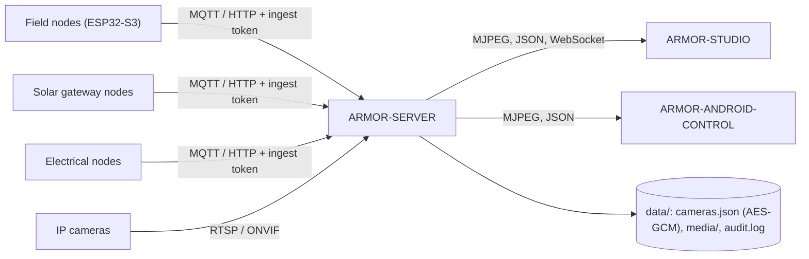

<p align="center">
  
</p>

# 🛡️ ARMOR-SERVER

<p align="center">
  <a href="README.md">🇺🇸 English</a> |
  🇪🇸 <b>Español</b> |
  <a href="README_fra.md">🇫🇷 Français</a> |
  <a href="README_ita.md">🇮🇹 Italiano</a> |
  <a href="README_deu.md">🇩🇪 Deutsch</a> |
  <a href="README_zho.md">🇨🇳 简体中文</a> |
  <a href="README_jpn.md">🇯🇵 日本語</a>
</p>

### Coordinador central de seguridad: entrada de telemetría, alarmas, dispositivos, lecturas solares y pasarela de cámaras

<p align="center">
  
  
  
  
  
</p>

---

**Comprobación de honestidad - qué funciona hoy:** Cada ruta, sesión, cifrado y regla de evidencias de abajo es real y está cubierta por pruebas (`npm test`, 168 pruebas, con una suite completa de integración HTTP contra un servidor aislado). Ha funcionado con un broker MQTT real en la CM5 (con scripts, no con firmware de nodo de campo), y ha emitido vídeo en vivo, guardado una captura y grabado desde cinco cámaras IP reales mediante FFmpeg. Lo que **aún no está probado**: ONVIF con una cámara ONVIF real, PTZ en cada firmware de cámara (funciona en la unidad Hi3510), cualquier hardware Jetson y las rutas solares con un nodo pasarela real (se prueban con lecturas generadas).

---

## 🎯 Descripción general

**ARMOR-SERVER** es el centro de confianza de A.R.M.O.R. Los nodos de campo publican observaciones de radar, luz y salud; este servicio las valida, guarda el último estado conocido de cada nodo y lo sirve a la consola Studio y al cliente Android. También es dueño de todo lo que toca una cámara, de modo que **ningún navegador ni teléfono guarda jamás una contraseña de cámara ni una dirección RTSP**.

* **Entrada validada:** las observaciones por HTTP y MQTT se comprueban en la frontera (identificador, marcas de tiempo, rango de lux, como máximo 15 pistas) antes de llegar a la proyección de estado.
* **Estado honesto de los nodos:** un nodo que deja de hablar se muestra como *obsoleto* y *desconectado* tras una ventana configurable, nunca como conectado con datos viejos. Desarmar borra una alerta alta al instante.
* **Pasarela de cámaras:** bóveda de cámaras cifrada, PTZ ONVIF / Hi3510 / PSIA, descubrimiento de rutas RTSP, un relé FFmpeg compartido por cámara, capturas y grabación MP4, y un vigilante que convierte una cámara que deja de responder en un evento y, estando armado, en una alarma.
* **Biblioteca de evidencias:** retención por antigüedad y tamaño empezando por lo más viejo, **evidencias protegidas** que nunca se borran y un SHA-256 para la cadena de custodia. Una línea de auditoría por cada acción relevante para la seguridad, sin credenciales.
* **Estado que sobrevive:** el modo de seguridad y la última observación de cada nodo se restauran tras un reinicio (un reinicio nunca desarma el perímetro en silencio). Cada cambio de nivel de alerta, de estado de nodo y de modo queda en un historial de eventos.
* **Salida de alarma:** las alertas altas y, estando armado, los nodos silenciosos o desconectados van a MQTT `armor/server/alert` y a un webhook opcional firmado con HMAC; el tiempo de permanencia antes de ALTA y las zonas ignoradas se ajustan desde Studio.
* **Usuarios:** nombres y contraseñas (hashes scrypt), un rol `admin` que gestiona usuarios y un rol `operator` que opera; cambiar una contraseña o un rol cierra las demás sesiones de ese usuario.
* **Dispositivos, alarmas y automatizaciones:** dispositivos de humo, gas, inundación, puerta, ventana, movimiento, clima, enchufe, luz, sirena y cerradura por MQTT o por envío autenticado, con estado normalizado, disponibilidad y comandos; alarmas con ciclo generada / reconocida / despejada; reglas que accionan dispositivos ante un suceso; armar y desarmar desde una sesión iniciada; y el diseño del sitio guardado en el servidor para todos los clientes.
* **Lecturas solares:** los inversores y las pilas de baterías (con cada celda y las capacidades) llegan por HTTP o MQTT, los valida el contrato compartido, se guardan con un historial (una muestra cada 30 s durante un día) y totales, se marcan como obsoletos a los dos minutos y levantan cuatro alarmas (avería del inversor, batería baja, alarma de batería, equipo en silencio).

## 🔄 Arquitectura



## 🔒 Modelo de seguridad

* Cuatro secretos separados: **ingesta** (enviar telemetría, salud y lecturas solares), **control** (armar / desarmar, eventos), **operador** (automatización) y el **acceso a Studio**; cada uno se compara en tiempo constante y ninguno sustituye a otro.
* Toda ruta que configura, mueve, captura, graba, protege o borra exige un operador. El vídeo en vivo exige un operador o un ticket de emisión de corta duración ligado a una cámara.
* Las contraseñas de las cámaras viven solo en `data/cameras.json`, cifradas con AES-256-GCM, y ninguna API las devuelve; las direcciones ONVIF deben quedarse en el host de la cámara y se rechazan las redirecciones.
* Las sesiones de Studio son HttpOnly y SameSite=Strict durante 8 horas, el inicio de sesión tiene límite de intentos y los errores nunca llevan traza de pila.
* El servidor escucha en 127.0.0.1 salvo que se indique `ARMOR_HOST` a propósito, y entonces se rechaza una contraseña de Studio de menos de 12 caracteres.

## 🌐 API

* Pública: `GET /healthz`. Para un operador: estado, información, cámaras, medios, historial, reglas, dispositivos, alarmas, automatizaciones, el diseño del sitio y `GET /api/v1/solar` con su historial.
* Para los nodos de campo y las pasarelas: `POST /api/v1/telemetry`, `/health`, `/solar` y `/electrical/readings` con el token de ingesta, y los temas MQTT `armor/node/#`, `armor/solar/#` y `armor/electrical/#`. Los eventos llegan a las consolas por el WebSocket `/api/v1/events`.
* Cada ruta, su regla de acceso y su esquema están en el archivo OpenAPI de [ARMOR-COMMON](../ARMOR-COMMON), y una prueba comprueba que no falte ninguna.

## ⚙️ Configuración

* Copia `.env.example` a `.env` (ignorado por Git), o deja que `run.bat` / `run.sh` genere secretos aleatorios en la primera ejecución.
* Obligatorias: `ARMOR_INGEST_TOKEN` y `ARMOR_CONTROL_TOKEN` (24 caracteres o más, todas distintas) y `ARMOR_STUDIO_USERNAME` / `ARMOR_STUDIO_PASSWORD` (el primer administrador).
* Habituales: `ARMOR_HOST` / `ARMOR_PORT`, `ARMOR_DATA_DIR`, `ARMOR_FFMPEG_PATH` (vídeo en vivo y captura), `ARMOR_MQTT_URL`, `ARMOR_STUDIO_ORIGIN`, `ARMOR_NODE_STALE_AFTER_S`, `ARMOR_CAMERA_CHECK_S`, `ARMOR_ALERT_DWELL_MS`, `ARMOR_ALERT_WEBHOOK_URL` y `ARMOR_COOKIE_SECURE` (ponlo a `1` detrás de TLS).

## 📂 Estructura del repositorio

```text
ARMOR-SERVER/
├── src/            server, app, config, context, store, persistence, events, rules, notify, contracts, mqtt, audit,
│   │               alarms, automations, users, site, solar, solar_registry, electrical
│   ├── http/       auth primitives
│   ├── routes/     sessions, cameras, media, ingest, history, devices, alarms, users, solar, electrical, system
│   ├── devices/    the device model, kinds and MQTT bridge
│   ├── cameras/    model, vault, digest, ptz, rtsp, discovery, health, errors
│   └── media/      relay, evidence
├── tests/          unit tests + full HTTP integration suite
├── docs/           state machine, camera gateway, integration
├── data/           runtime state (ignored by Git)
└── images/         brand assets
```

## 🛠️ Entorno de desarrollo

```powershell
npm install
npm run typecheck   # tsc --noEmit
npm test            # 168 tests: unit + full HTTP integration
npm run build       # dist/server.mjs
.\run.bat           # development server with hot reload
```

Para instalar en el banco de pruebas de la CM5 (aislado de todo otro proyecto, con usuario y puertos propios) véase [ARMOR-DEVOPS](../ARMOR-DEVOPS).

## 🔗 Proyectos relacionados

**A.R.M.O.R.** (Autonomous Radar & Multimodal Observation Range) es un sistema de seguridad perimetral hecho de repositorios independientes. Cada uno tiene su propia versión, sus propias pruebas y su propio README; esta es la familia:

* **[ARMOR-COMMON](../ARMOR-COMMON)** - Contratos de mensajes, validadores, vectores de conformidad y tipos generados
* **[ARMOR-RADAR](../ARMOR-RADAR)** - Firmware del nodo de campo para ESP32-S3 con tres radares y su propio panel web
* **[ARMOR-SOLAR](../ARMOR-SOLAR)** - Protocolos de inversores y baterías solares y los mensajes de un nodo pasarela
* **[ARMOR-ELECTRICAL](../ARMOR-ELECTRICAL)** - Nodo eléctrico: contadores, el mensaje de las lecturas de la red y las reglas para maniobrar
* **[ARMOR-NETWORK](../ARMOR-NETWORK)** - La red local: sus dispositivos, internet y lo que cambia
* **ARMOR-SERVER** (este repositorio) - Coordinador central: telemetría, alarmas, dispositivos, lecturas solares y cámaras
* **[ARMOR-STUDIO](../ARMOR-STUDIO)** - Consola web: cámaras, radar, alarmas, energía solar y el diseñador de sitio 2D/3D
* **[ARMOR-ANDROID-CONTROL](../ARMOR-ANDROID-CONTROL)** - Cliente Android del operador con radar 2D/3D en vivo
* **[ARMOR-SERVER-AI](../ARMOR-SERVER-AI)** - Política de inferencia visual que explica sus decisiones y nunca actúa
* **[ARMOR-VOICE-AI](../ARMOR-VOICE-AI)** - Intenciones de voz sin conexión con una confirmación imposible de falsificar
* **[ARMOR-HARDWARE](../ARMOR-HARDWARE)** - Cajas, electrónica y la matriz de aceptación en banco
* **[ARMOR-DEVOPS](../ARMOR-DEVOPS)** - Despliegue, el banco de pruebas de la CM5, copias de seguridad y TLS
* **[ARMOR-SIMULATOR](../ARMOR-SIMULATOR)** - Simulador de telemetría sin conexión con fallos repetibles
* **[ARMOR-UPDATER](../ARMOR-UPDATER)** - Detecta, instala y actualiza los propios repositorios del ecosistema
* **[ARMOR-DOCS](../ARMOR-DOCS)** - Arquitectura, base de seguridad y la matriz de capacidades

## 📚 Documentación y comunidad

Dónde leer más:

* [Matriz de capacidades: qué está probado y qué no](../ARMOR-DOCS/docs/CAPABILITY_MATRIX.md)
* [Catálogo de proyectos: versiones y cómo dependen unos de otros](../ARMOR-DOCS/docs/PROJECT_CATALOG.md)
* [Historial de cambios de este repositorio](CHANGELOG.md)
* [Licencia (GPL-3.0-or-later)](LICENSE)
* Preguntas, ideas e informes: electrohobby3d@gmail.com

## 👤 AUTOR

**JuanenRac (Electro Hobby 3D)** · electrohobby3d@gmail.com

## 📜 LICENCIA

GPL-3.0-or-later - véase [LICENSE](LICENSE).
