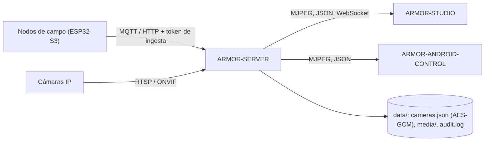

<p align="center">
  
</p>

# 🛡️ ARMOR-SERVER

<p align="center"><a href="README.md">🇺🇸 English</a> | 🇪🇸 <b>Español</b></p>

### 🧠 Coordinador central de seguridad, ingesta de telemetría y pasarela de cámaras

<p align="center">
  
  
  
  
  
</p>

---

**Comprobación de honestidad - qué funciona hoy:** cada ruta, sesión, cifrado y regla de evidencias descrita aquí es real y está cubierta por tests (`npm test`, 130 tests, con una suite de integración HTTP completa contra un servidor aislado). Ha funcionado contra un broker MQTT real en la CM5 (con scripts, no con el firmware de un nodo). Ha transmitido vídeo en directo, guardado una captura y grabado con cinco cámaras IP reales mediante FFmpeg en la CM5. Lo que **todavía no está demostrado**: ONVIF/PTZ con todos los firmwares de cámara y cualquier hardware Jetson. Son hitos de despliegue, recogidos en [ARMOR-DOCS](../ARMOR-DOCS); este README nunca los da por hechos.

---

## 1. 🛠️ DESCRIPCIÓN

**ARMOR-SERVER** es el centro de confianza de A.R.M.O.R. Los nodos de campo publican observaciones de radar, luz y salud; este servicio las valida, guarda el último estado conocido de cada nodo y lo sirve a la consola Studio y al cliente Android. También es dueño de todo lo que toca una cámara, de modo que **ningún navegador ni teléfono guarda nunca una contraseña de cámara ni una dirección RTSP**.

* 📡 **Ingesta validada:** las observaciones HTTP y MQTT se comprueban en la frontera (identificador, marcas de tiempo, rango de lux, máximo 15 pistas) antes de llegar al estado.
* 🧭 **Estado de nodo honesto:** un nodo que deja de hablar pasa a *obsoleto* y *desconectado* tras una ventana configurable; nunca se muestra en línea con datos viejos. Al desarmar se limpia una alerta alta al instante.
* 🔐 **Credenciales separadas:** los secretos de ingesta, control, operador y acceso a Studio son distintos, se comparan en tiempo constante y ninguno sirve como credencial de otro propósito.
* 🎥 **Pasarela de cámaras:** bóveda cifrada, PTZ ONVIF / Hi3510 / PSIA, descubrimiento de rutas RTSP, un único relé FFmpeg compartido por cámara, capturas y grabación MP4.
* 🗄️ **Biblioteca de evidencias:** retención por antigüedad y tamaño (la más antigua primero), **evidencia protegida** que nunca se borra sola y SHA-256 para la cadena de custodia.
* 🧾 **Auditoría:** una línea JSON por cada acción relevante para la seguridad, sin credenciales.
* 💾 **Estado que sobrevive:** el modo de seguridad y la última observación de cada nodo se restauran tras un reinicio (un reinicio nunca desarma el perímetro en silencio).
* 📜 **Historial de eventos:** cada cambio de nivel de alerta, de estado de nodo y de modo queda registrado y se consulta paginado con `GET /api/v1/history`.
* 📷 **Vigilancia de cámaras:** cada cámara configurada se sondea en sus puertos RTSP y ONVIF; una que deja de responder se convierte en un evento y, con el sistema armado, en una alarma.
* 🚨 **Salida de alarma:** las alertas altas y, con el sistema armado, los nodos en silencio o fuera de línea van a MQTT `armor/server/alert` y a un webhook opcional firmado con HMAC.
* 🎯 **Reglas de alerta:** un tiempo de permanencia antes de ALTA y zonas ignoradas, ajustables desde Studio.

---

## 2. 🔄 ARQUITECTURA



| Módulo (`src/`) | Responsabilidad |
|---|---|
| `config.ts` | Lee y **valida** el entorno; rechaza ajustes débiles o incoherentes |
| `http/auth.ts` | Comparación en tiempo constante, cookies, sesiones acotadas y con caducidad |
| `context.ts` | Contexto compartido (almacenes, sesiones, comprobación de operador) |
| `app.ts` / `server.ts` | Ensamblado HTTP + WebSocket / arranque y apagado ordenado |
| `routes/*.ts` | `sessions`, `cameras`, `media`, `ingest` |
| `cameras/*.ts` | `model` (validación), `vault` (AES-256-GCM), `digest` (RFC 7616), `ptz`, `rtsp`, `discovery` |
| `media/*.ts` | `relay` (MJPEG con FFmpeg y tickets de stream), `evidence` (captura, retención, hash) |
| `store.ts` / `contracts.ts` / `mqtt.ts` | Estado, validación de frontera, ingesta MQTT |
| `audit.ts` | Registro de auditoría JSON con rotación |

---

## 3. 🔒 MODELO DE SEGURIDAD

| Credencial | Permite | Nunca permite |
|---|---|---|
| `ARMOR_INGEST_TOKEN` | Enviar telemetría y salud | Leer cámaras, armar |
| `ARMOR_CONTROL_TOKEN` | Armar / desarmar, eventos WebSocket | Trabajo con cámaras |
| `ARMOR_OPERATOR_TOKEN` | Sesión de operador para automatización | Ingesta, armado |
| Acceso a Studio (`admin` + contraseña) | Sesión de 8 h **HttpOnly, SameSite=Strict** para cámaras, PTZ y evidencias | El token de operador en sí |

* Toda ruta que configura, mueve, captura, graba, protege o borra exige un operador. El **vídeo en directo** exige un operador **o** un ticket de stream de vida corta y ligado a la cámara que solo un operador puede obtener.
* Las contraseñas de cámara solo se guardan en `data/cameras.json`, cifradas con AES-256-GCM y `ARMOR_CAMERA_CONFIG_KEY`, y ninguna API las devuelve. Rotar un token no deja las cámaras sin acceso.
* Las direcciones de servicio ONVIF que anuncia una cámara solo se aceptan si siguen en el host configurado; se rechazan las redirecciones HTTP.
* El descubrimiento explora una `/24` privada, no envía credenciales, ejecuta **un solo escaneo a la vez** y se detiene si el cliente se desconecta.
* El acceso está limitado en frecuencia, las sesiones tienen tope de número y duración, y los errores JSON nunca llevan trazas.
* Por defecto el servidor escucha en **127.0.0.1**. `ARMOR_HOST` debe fijarse a propósito para llegar desde otra máquina y entonces se rechaza una contraseña de Studio de menos de 12 caracteres.

---

## 4. 🌐 API

`GET /healthz` (público) · `GET /api/v1/status` · `GET /api/v1/info` · `GET /api/v1/camera-views`

| Área | Rutas (todas exigen operador salvo indicación) |
|---|---|
| Sesiones | `POST/GET/DELETE /api/v1/studio/session` · `POST/DELETE /api/v1/operator/session` |
| Ingesta | `POST /api/v1/telemetry`, `POST /api/v1/health` (token de ingesta) · `POST /api/v1/control/arm\|disarm` (token de control) |
| Cámaras | `GET /api/v1/cameras` · `POST /cameras/configure` · `DELETE /cameras/:id` · `POST /cameras/discover` · `POST /cameras/:id/ptz` · `POST /cameras/:id/discover-rtsp` · `POST /cameras/:id/stream-ticket` |
| Directo / captura | `GET /cameras/:id/mjpeg` (operador **o** ticket) · `POST /cameras/:id/snapshot` · `POST /cameras/:id/recordings/start\|stop` |
| Evidencias | `GET /api/v1/media` · `GET /media/:camara/:tipo/:archivo` · `GET …/sha256` · `PUT …/protected` · `DELETE …` · `DELETE /media` |
| Vigilancia y nodos | `GET /api/v1/camera-status` · `DELETE /api/v1/nodes/:id` |
| Historial y reglas | `GET /api/v1/history?limit&before&type&node` · `GET/PUT /api/v1/rules` |
| Eventos | WebSocket `/api/v1/events` (token de control o cookie de sesión) |

El contrato legible por máquina está en [ARMOR-COMMON](../ARMOR-COMMON).

---

## 5. ⚙️ CONFIGURACIÓN

Copia `.env.example` a `.env` (ignorado por Git) o deja que `run.bat` / `run.sh` genere secretos aleatorios en la primera ejecución.

| Variable | Por defecto | Significado |
|---|---|---|
| `ARMOR_HOST` / `ARMOR_PORT` | `127.0.0.1` / `8080` | Dirección de escucha |
| `ARMOR_INGEST_TOKEN`, `ARMOR_CONTROL_TOKEN` | obligatorios | ≥ 24 caracteres cada uno, todos distintos |
| `ARMOR_OPERATOR_TOKEN` | token de control | Token de automatización de operador |
| `ARMOR_CAMERA_CONFIG_KEY` | token de control (solo migración) | Clave de la bóveda de cámaras |
| `ARMOR_STUDIO_USERNAME` / `_PASSWORD` | obligatorios | Acceso a Studio (contraseña ≥ 12 caracteres fuera de loopback) |
| `ARMOR_STUDIO_ORIGIN` | Studio local | Orígenes de Studio permitidos, separados por comas |
| `ARMOR_DATA_DIR` | `./data` | Bóveda, evidencias y auditoría |
| `ARMOR_FFMPEG_PATH` | sin definir | Activa el vídeo en directo y las capturas |
| `ARMOR_MAX_MJPEG_RELAYS` | `8` | Relés compartidos (uno por cámara activa) |
| `ARMOR_MEDIA_MAX_BYTES` / `_RETENTION_DAYS` | 20 GiB / 30 | Límites de evidencias |
| `ARMOR_NODE_STALE_AFTER_S` | `30` | Silencio tras el que un nodo se considera obsoleto |
| `ARMOR_CAMERA_CHECK_S` | `20` | Segundos entre comprobaciones de las cámaras (0 las desactiva) |
| `ARMOR_ALERT_DWELL_MS` | `2000` | Tiempo que deben persistir dos objetivos antes de ALTA (0 = al instante) |
| `ARMOR_ALERT_WEBHOOK_URL` / `_SECRET` | sin definir | Webhook de alarma opcional, firmado con `X-Armor-Signature` si hay secreto |
| `ARMOR_MQTT_URL` (+ `_USERNAME`, `_PASSWORD`) | sin definir | Ingesta MQTT opcional |
| `ARMOR_COOKIE_SECURE` | `0` | Pon `1` detrás de TLS |

---

## 6. 🔧 COMPILAR Y EJECUTAR

```powershell
npm install
npm run typecheck   # tsc --noEmit
npm test            # 130 tests: unitarios + integración HTTP completa
npm run build       # dist/server.mjs
.\run.bat           # servidor de desarrollo con recarga
```

Para instalar en el banco de pruebas CM5 (aislado de cualquier otro proyecto, con usuario y puertos propios) consulta [ARMOR-DEVOPS](../ARMOR-DEVOPS).

---

## 📂 ESTRUCTURA DE DIRECTORIOS

```text
ARMOR-SERVER/
├── src/            server, app, config, context, store, persistence, events, rules, notify, contracts, mqtt, audit
│   ├── http/       primitivas de autenticación
│   ├── routes/     sessions, cameras, media, ingest, history
│   ├── cameras/    model, vault, digest, ptz, rtsp, discovery, health, errors
│   └── media/      relay, evidence
├── tests/          tests unitarios + integración HTTP completa
├── docs/           máquina de estados, pasarela de cámaras, integración
├── data/           estado en ejecución (ignorado por Git)
└── images/         recursos de marca
```

---

## 👤 AUTOR

**JuanenRac (Electro Hobby 3D)** · electrohobby3d@gmail.com

## 📜 LICENCIA

GPL-3.0-or-later - véase [LICENSE](LICENSE).
