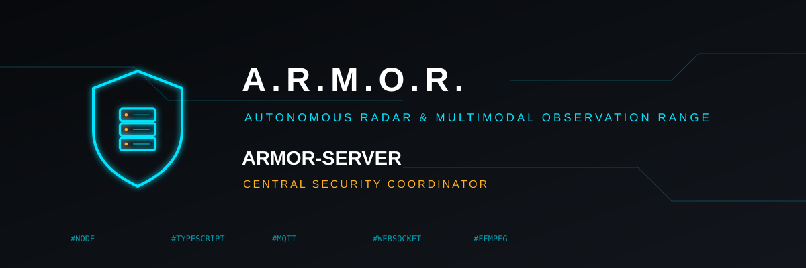
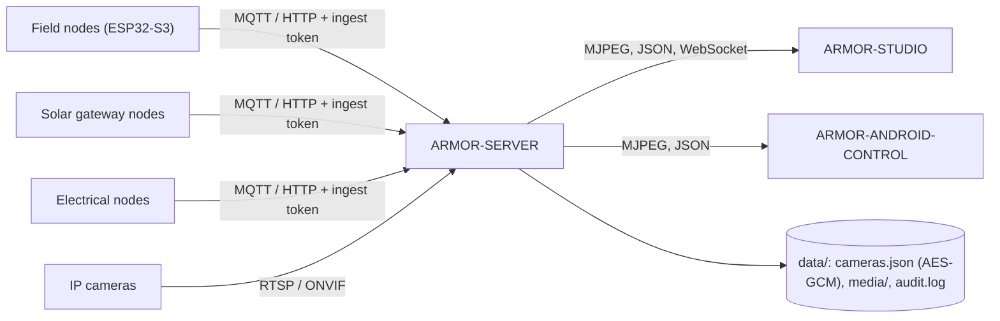

<p align="center">
  
</p>

# 🛡️ ARMOR-SERVER

<p align="center">
  <a href="README.md">🇺🇸 English</a> |
  <a href="README_spa.md">🇪🇸 Español</a> |
  <a href="README_fra.md">🇫🇷 Français</a> |
  <a href="README_ita.md">🇮🇹 Italiano</a> |
  <a href="README_deu.md">🇩🇪 Deutsch</a> |
  🇨🇳 <b>简体中文</b> |
  <a href="README_jpn.md">🇯🇵 日本語</a>
</p>

### 中央安全协调器：遥测入口、报警、设备、太阳能读数和摄像头网关

<p align="center">
  
  
  
  
  
</p>

---

**诚实性检查 - 今天真正能运行的部分:** 下面的每条路由、会话、加密和证据规则都是真实的，并有测试覆盖（`npm test`，272 个测试，其中包括针对隔离服务器的完整 HTTP 集成测试）。它已在 CM5 上对着真实的 MQTT 代理运行过（用的是脚本和两个真实的雷达节点），并通过 FFmpeg 从五台真实 IP 摄像头推送过实时视频、保存过快照并录过像。**尚未证实的：** 对真实 ONVIF 摄像头的 ONVIF、每种摄像头固件上的 PTZ（在 Hi3510 设备上可用）、任何 Jetson 硬件，以及对真实网关节点的太阳能路由（它们用生成的读数测试）。

---

## 🎯 概述

**ARMOR-SERVER** 是 A.R.M.O.R. 的可信中心。现场节点发布雷达、光照和健康观测；本服务验证它们，保存每个节点最后已知的状态，并提供给 Studio 控制台和 Android 客户端。它还掌管一切接触摄像头的事务，因此**没有任何浏览器或手机持有摄像头密码或 RTSP 地址**。

* **经过验证的入口：** HTTP 和 MQTT 观测在边界处检查（标识符、时间戳、lux 范围、最多 15 条轨迹），之后才进入状态投影。
* **诚实的节点状态：** 停止发声的节点在可配置的时间窗后显示为*过期*和*离线*，绝不会以旧数据显示为在线。撤防会立即清除高级警报。
* **摄像头网关：** 加密的摄像头保险库、ONVIF / Hi3510 / PSIA PTZ、RTSP 路径发现、每台摄像头共用一个 FFmpeg 中继、快照和 MP4 录像，以及一个监视器，把不再响应的摄像头变成事件，布防时变成报警。
* **证据库：** 按时间和大小保留，最旧的先清理，**受保护的证据**永不清理，并有用于保管链的 SHA-256。每个与安全相关的操作留一行审计记录，凭据已被清除。
* **能保留的状态：** 安全模式和每个节点的最后观测在重启后恢复（重启绝不会悄悄撤防周界）。每次警报级别、节点状态和模式的变化都记入事件历史。
* **报警输出：** 高级警报以及布防时静默或离线的节点会发送到 MQTT `armor/server/alert` 和可选的 HMAC 签名 webhook；进入 HIGH 之前的停留时间和忽略区域在 Studio 中调整。
* **用户：** 名称和密码（scrypt 哈希）、管理用户的 `admin` 角色和负责操作的 `operator` 角色；更改密码或角色会结束该用户的其他会话。
* **设备、报警与自动化：** 烟雾、燃气、水浸、门、窗、移动、气候、插座、灯、警笛和门锁设备，通过 MQTT 或经认证的推送接入，带规范化状态、可用性和命令；报警有触发 / 已确认 / 已清除的生命周期；在事件发生时切换设备的规则；从已登录会话布防和撤防；以及为所有客户端保存在服务器上的场地设计。
* **太阳能读数：** 逆变器和电池组（含每个电芯和容量）通过 HTTP 或 MQTT 到达，由共享契约验证，保存历史（一天内每 30 s 一个样本）和合计，两分钟后标记为过期，并触发四种报警（逆变器故障、电池电量低、电池报警、设备静默）。
* **机器、网络与面板：** `GET /api/v1/system/metrics`（运行所在机器的 CPU、内存、磁盘、温度、网络及简短历史）、`GET/PUT /api/v1/system/connection`（监听的地址和端口，仅管理员，下次启动生效）、`GET /api/v1/panel/summary`（供小屏幕使用的几百字节）；对于网络节点，还有管理员为设备网页管理保存的登录：加密（AES-256-GCM）保存、从不返回，仅在需要它的那一条 `inspect` 指令中交给节点。

## 🔄 架构



## 🔒 安全模型

* 四个相互独立的机密：**摄取**（发送遥测、健康和太阳能读数）、**控制**（布防 / 撤防、事件）、**操作员**（自动化）和 **Studio 登录**；每个都以恒定时间比较，任何一个都不能代替另一个。
* 每条配置、移动、抓拍、录制、保护或删除的路由都需要操作员。实时视频需要操作员，或绑定某台摄像头的短期视频流票据。
* 摄像头密码只保存在 `data/cameras.json` 中，使用 AES-256-GCM 加密，任何 API 都不会返回；ONVIF 地址必须留在摄像头所在主机上，重定向会被拒绝。
* Studio 会话为 HttpOnly 和 SameSite=Strict，有效期 8 小时，登录有频率限制，错误绝不会带堆栈跟踪。
* 服务器默认只监听 127.0.0.1，除非有意设置 `ARMOR_HOST`，此时短于 12 个字符的 Studio 密码会被拒绝。

## 🌐 API

* 公开：`GET /healthz`。对操作员：状态、信息、摄像头、媒体、历史、规则、设备、报警、自动化、场地设计，以及带历史的 `GET /api/v1/solar`。
* 对现场节点和网关：使用摄取令牌的 `POST /api/v1/telemetry`、`/health`、`/solar` 和 `/electrical/readings`，以及 MQTT 主题 `armor/node/#`、`armor/solar/#` 和 `armor/electrical/#`。事件通过 WebSocket `/api/v1/events` 到达控制台。
* 每条路由、其访问规则和模式都在 [ARMOR-COMMON](https://github.com/JuanenRac/ARMOR-COMMON) 的 OpenAPI 文件中，并有测试确保没有遗漏的路由。

## ⚙️ 配置

* 把 `.env.example` 复制为 `.env`（Git 会忽略它），或让 `run.bat` / `run.sh` 在首次运行时生成随机机密。
* 必填：`ARMOR_INGEST_TOKEN` 和 `ARMOR_CONTROL_TOKEN`（24 个字符或更长，且互不相同）以及 `ARMOR_STUDIO_USERNAME` / `ARMOR_STUDIO_PASSWORD`（第一个管理员）。
* 常用：`ARMOR_HOST` / `ARMOR_PORT`、`ARMOR_DATA_DIR`、`ARMOR_FFMPEG_PATH`（实时视频和抓拍）、`ARMOR_MQTT_URL`、`ARMOR_STUDIO_ORIGIN`、`ARMOR_NODE_STALE_AFTER_S`、`ARMOR_CAMERA_CHECK_S`、`ARMOR_ALERT_DWELL_MS`、`ARMOR_ALERT_WEBHOOK_URL` 和 `ARMOR_COOKIE_SECURE`（在 TLS 之后设为 `1`）。
* **固件、通知与语音：** 服务器可更新现场节点的固件（文件或 GitHub 发布版，单个节点或某一类型的全部节点，带进度并校验 SHA-256），把警报发送到 Telegram 和 Home Assistant（带重试，审计行不含机密，支持七种语言），并通过语音网关执行十五条书面或语音命令（状态、警报、节点、摄像头、雷达、太阳能与电气系统、网络、时间、帮助和灯光；布防与撤防需在第二轮确认）。观察服务使用自己的令牌触发 `camera_motion`。见[节点固件](docs/NODE_FIRMWARE.md)和[集成](docs/INTEGRATION.md)。

## 📂 仓库结构

```text
ARMOR-SERVER/
├── src/            server, app, config, context, store, persistence, events, rules, notify, contracts, mqtt, audit,
│   │               alarms, automations, users, site, solar, solar_registry, electrical
│   ├── http/       auth primitives
│   ├── routes/     sessions, cameras, media, ingest, history, devices, alarms, users, solar, electrical, system
│   ├── devices/    the device model, kinds and MQTT bridge
│   ├── cameras/    model, vault, digest, ptz, rtsp, discovery, health, errors
│   └── media/      relay, evidence
├── tests/          unit tests + full HTTP integration suite
├── docs/           state machine, camera gateway, integration
├── data/           runtime state (ignored by Git)
└── images/         brand assets
```

## 🛠️ 开发环境

```powershell
npm install
npm run typecheck   # tsc --noEmit
npm test            # 272 tests: unit + full HTTP integration
npm run build       # dist/server.mjs
.\run.bat           # development server with hot reload
```

要安装到 CM5 测试台（与其他项目隔离，使用独立用户和端口），参见 [ARMOR-DEVOPS](https://github.com/JuanenRac/ARMOR-DEVOPS)。

## 🔗 相关项目

**A.R.M.O.R.**（Autonomous Radar & Multimodal Observation Range）是由若干独立仓库组成的周界安防系统。每个仓库都有自己的版本、测试和 README；家族成员如下：

* **[ARMOR-COMMON](https://github.com/JuanenRac/ARMOR-COMMON)** - 消息契约、验证器、一致性向量和生成的类型
* **[ARMOR-RADAR](https://github.com/JuanenRac/ARMOR-RADAR)** - 适用于 ESP32-S3 的现场节点固件，带三个雷达和自带网页面板
* **[ARMOR-SOLAR](https://github.com/JuanenRac/ARMOR-SOLAR)** - 太阳能逆变器与电池的协议，以及网关节点的消息
* **[ARMOR-ELECTRICAL](https://github.com/JuanenRac/ARMOR-ELECTRICAL)** - 电气节点：电表、电网读数消息和开关规则
* **[ARMOR-ALARM](https://github.com/JuanenRac/ARMOR-ALARM)** - 报警节点与报警主机：防区、布防、延时、警笛和 PIN，有无服务器均可
* **[ARMOR-HMI](https://github.com/JuanenRac/ARMOR-HMI)** - 触摸面板：墙面屏幕上的系统状态、布防与确认，以及语音助手的所在
* **[ARMOR-NETWORK](https://github.com/JuanenRac/ARMOR-NETWORK)** - 本地网络：其设备、互联网以及变化
* **ARMOR-SERVER** (本仓库) - 中央协调器：遥测、报警、设备、太阳能读数和摄像头
* **[ARMOR-STUDIO](https://github.com/JuanenRac/ARMOR-STUDIO)** - 网页控制台：摄像头、雷达、报警、太阳能和 2D/3D 场地设计器
* **[ARMOR-ANDROID-CONTROL](https://github.com/JuanenRac/ARMOR-ANDROID-CONTROL)** - 带实时 2D/3D 雷达的 Android 操作员客户端
* **[ARMOR-SERVER-AI](https://github.com/JuanenRac/ARMOR-SERVER-AI)** - 会解释决策且从不执行动作的视觉推理策略
* **[ARMOR-VOICE-AI](https://github.com/JuanenRac/ARMOR-VOICE-AI)** - 带无法伪造确认的离线语音意图
* **[ARMOR-HARDWARE](https://github.com/JuanenRac/ARMOR-HARDWARE)** - 外壳、电子器件和台架验收矩阵
* **[ARMOR-DEVOPS](https://github.com/JuanenRac/ARMOR-DEVOPS)** - 部署、CM5 测试台、备份与 TLS
* **[ARMOR-SIMULATOR](https://github.com/JuanenRac/ARMOR-SIMULATOR)** - 带可重复故障的离线遥测模拟器
* **[ARMOR-UPDATER](https://github.com/JuanenRac/ARMOR-UPDATER)** - 发现、安装并更新生态系统自身的仓库
* **[ARMOR-DOCS](https://github.com/JuanenRac/ARMOR-DOCS)** - 架构、安全基线和能力矩阵

## 📚 文档与社区

更多阅读：

* [能力矩阵：哪些已被证实，哪些没有](https://github.com/JuanenRac/ARMOR-DOCS/blob/main/docs/CAPABILITY_MATRIX.md)
* [项目目录：版本以及各仓库之间的依赖](https://github.com/JuanenRac/ARMOR-DOCS/blob/main/docs/PROJECT_CATALOG.md)
* [本仓库的变更记录](CHANGELOG.md)
* [许可证（GPL-3.0-or-later）](LICENSE)
* 问题、想法与反馈：electrohobby3d@gmail.com

## 👤 作者

**JuanenRac (Electro Hobby 3D)** · electrohobby3d@gmail.com

## 📜 许可证

GPL-3.0-or-later - 见 [LICENSE](LICENSE)。
